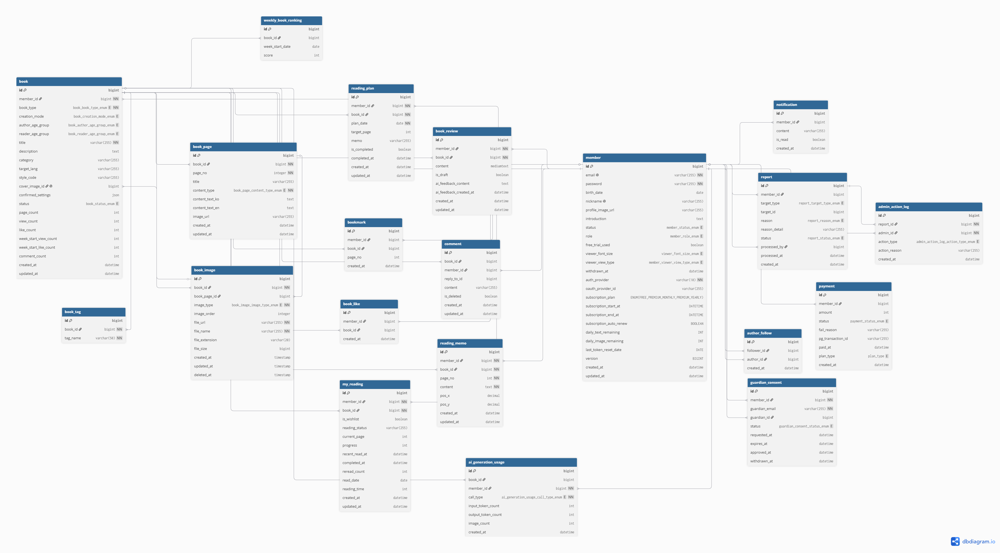
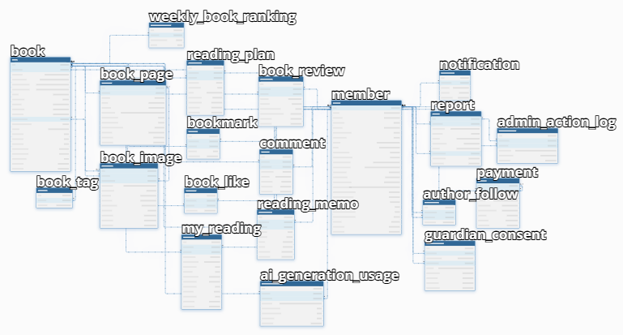
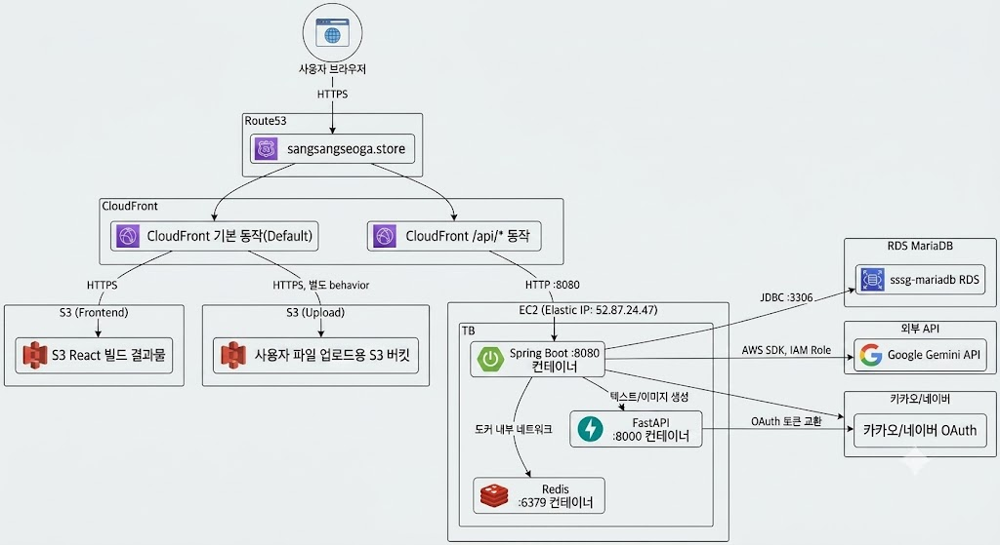

# 상상서가 (SangSangSeoGa) - Backend

AI를 활용해 누구나 자신만의 동화, 에세이, 시, 소설을 만들고 공유할 수 있는 창작·독서 플랫폼의 백엔드 프로젝트입니다.

## 기술 스택

- Java 11 / Spring Boot 2.7.17
- Spring Data JPA, QueryDSL 5.0.0
- Spring Security + JWT (com.auth0:java-jwt)
- MariaDB
- Redis
- Gemini API (텍스트 생성)
- springdoc-openapi (Swagger UI)

## ERD

[dbdiagram.io - Kosta Final SangSangSeoGa](https://dbdiagram.io/d/Kosta-Final-SangSangSeoGa-6a39f4e19340ecc065f33680) (편집 가능한 원본)

**상세 (전체 컬럼)**


**개요 (테이블 관계)**


## 인프라 구성

실제 배포된 AWS 아키텍처입니다. 자세한 컴포넌트별 값(EC2/RDS 리전, CloudFront behavior 등)과 CI/CD 파이프라인은 [10-infrastructure-architecture.md](docs/dev/10-infrastructure-architecture.md) 참고.



## 도메인 구조

| 도메인 | 설명 |
| --- | --- |
| `auth` | 이메일 회원가입/로그인/로그아웃/토큰 재발급/비밀번호 재설정, 카카오·네이버 소셜 로그인(인가 URL 발급 → 콜백 → 신규 시 2단계 가입) |
| `member` | 회원 정보 조회/수정(닉네임/프로필/소개), 뷰어 환경설정, 보호자(법정대리인) 동의(만 14세 미만 계정 활성화), 회원 탈퇴 |
| `book` | 책 생성(발행)/목록(필터·정렬·키워드)/내 책 목록/상세/본문(페이지) 조회, 조회수 증가, 함께 읽기 추천, 주간 인기 랭킹·신작 집계 |
| `editor` | (미구현) 장르별(에세이/동화/소설/시/비문학) AI 창작 설정값 모델링 예정 - 현재 컨트롤러만 존재하는 빈 스텁 |
| `ai` | 단일 엔드포인트(`/api/ai/generate`)로 설정 수집/선택지/페이지 계획/본문 작성·수정/삽화 프롬프트까지 처리(Python FastAPI로 위임), 스트리밍 미리보기(SSE), 이미지 생성(Replicate 경유 → 영구 URL 저장), 호출별 토큰/생성량 사용 기록 |
| `subscription` | 구독 플랜(FREE/PREMIUM 월간·연간), Mock 결제, 만료 시 자동 정리(reconcile), 일일/생애 AI 사용량 조회·차감, 배치 스케줄러 |
| `myLibrary` | 내 서재 - 위시리스트, 읽는 중/완독 상태·진행률·재독, 내가 쓴 책 관리(상태 변경/설명·태그 수정/삭제), 독후감(초안 저장, AI 피드백), 페이지별 독서 메모, 독서 계획, 내가 제출/받은 신고 내역 |
| `friendLibrary` | 친구 서재 - 작가 검색/팔로우, 책 좋아요/북마크, 댓글·대댓글, 신고 접수 |
| `notification` | DB 이력 + Redis Streams + SSE로 실시간 알림 push(신간/댓글/좋아요/팔로우/신고 처리/회원 상태 변경/보호자 동의/구독 갱신 등) |
| `admin` | 신고 처리(책 숨김/댓글 삭제/작가 정지/반려), 회원 목록 조회/상태 변경(정지·복원·탈퇴) 등 관리자 액션 |

## 프로젝트 구조

각 도메인(`domain/{도메인명}`)은 아래와 같은 레이어드 구조를 따릅니다. 기능을 찾을 때 이 순서로 따라가면 됩니다.

```
domain/{도메인명}
 ├─ controller   # HTTP 요청/응답 (엔드포인트)
 ├─ service      # 비즈니스 로직
 ├─ repository   # DB 접근 (Spring Data JPA / QueryDSL)
 ├─ entity       # DB 테이블과 매핑되는 JPA 엔티티
 ├─ dto          # 요청/응답에 사용하는 데이터 객체
 └─ enums        # 도메인에서 쓰는 상태값(enum)
```

## 공통 응답 형식

모든 API는 `ApiResponse<T>` (`global/common/ApiResponse.java`)로 감싸서 응답합니다.

```json
{
  "success": true,
  "data": { "...": "실제 응답 데이터" },
  "code": null,
  "message": "성공"
}
```

- `success`: 요청 성공 여부
- `data`: 성공 시 실제 데이터, 실패 시 `null`
- `code`: 비즈니스 에러 식별 코드 (성공 시 `null`)
- `message`: 사람이 읽을 수 있는 메시지 (디버깅용)

## 시작하기

### 1. 사전 준비물

아래 프로그램이 설치되어 있어야 합니다. Gradle은 wrapper(`gradlew`)가 포함되어 있어 따로 설치할 필요 없습니다.

- JDK 11 이상 (`java -version`으로 확인)
- MariaDB (기본 포트 3306)
- Docker Desktop (Redis, MailHog 컨테이너 실행용) - 설치 후 **실행되어 있는 상태**여야 합니다.
- Git

### 2. 저장소 클론

```bash
git clone <저장소 주소>
cd sangsangseoga-springboot
```

**IntelliJ**: `File → Open`으로 프로젝트 루트(`build.gradle`이 있는 폴더)를 열면 Gradle 프로젝트로 자동 인식됩니다.

**STS(Spring Tool Suite)**: `File → Import → Gradle → Existing Gradle Project`를 선택한 뒤 프로젝트 루트를 지정하고 Finish. Import 후 프로젝트 우클릭 → `Gradle → Refresh Gradle Project`를 한 번 해주면 의존성이 정상적으로 잡힙니다.

### 3. 데이터베이스 스키마 생성

MariaDB에 접속해서 빈 스키마만 만들어두면, 테이블은 서버가 자동으로 생성합니다.

```sql
CREATE DATABASE sangsangseoga CHARACTER SET utf8mb4;
```

### 4. 환경 변수 설정

`src/main/resources/application.yml`은 공통 설정 + `dev`/`prod` 프로필로 나뉘어 있습니다. 아래 표도 그 구조를 그대로 따릅니다.

#### 4-1. 공통 환경변수 (dev/prod 동일하게 적용)

| 변수명 | 기본값 | 설명 |
| --- | --- | --- |
| `GEMINI_API_KEY` | 없음 (**필수**) | Gemini API 키. **dev/prod 관계없이 값이 없으면 스프링 컨텍스트 초기화 자체가 실패해 서버가 아예 뜨지 않습니다** (AI 기능만 실패하는 게 아님). 로컬에서 AI 기능을 안 쓰더라도 서버를 켜려면 아무 문자열이든 값을 넣어야 합니다 |
| `GEMINI_MODEL` | `gemini-2.5-flash` | 사용할 Gemini 모델명. `gemini.api.url`의 모델 경로에 그대로 들어갑니다(예: `gemini-2.5-pro`로 교체 가능) |
| `REPLICATE_API_TOKEN` | 없음(빈 값 허용) | Replicate API 토큰. 현재 `ReplicateClient`가 미구현 스텁이라 실제로 소비하는 코드는 없고, 향후 이미지 생성 연동을 대비해 설정값만 미리 열어둔 상태입니다. 없어도 서버 구동에 영향 없음 |
| `FASTAPI_BASE_URL` | `http://localhost:8000` | AI 텍스트/이미지 생성을 위임하는 별도 FastAPI 서비스 주소 |
| `KAKAO_CLIENT_ID` | 없음 | 카카오 로그인 REST API 키. 없어도 서버는 뜨지만, 카카오 로그인 API 호출 시 `OAUTH_NOT_CONFIGURED`(503)로 실패함 |
| `KAKAO_CLIENT_SECRET` | 없음 | 카카오 콘솔에서 Client Secret을 활성화한 경우에만 필요(선택) |
| `NAVER_CLIENT_ID` | 없음 | 네이버 로그인 클라이언트 ID. 없어도 서버는 뜨지만, 네이버 로그인 API 호출 시 `OAUTH_NOT_CONFIGURED`(503)로 실패함 |
| `NAVER_CLIENT_SECRET` | 없음 | 네이버 로그인 클라이언트 시크릿(네이버는 카카오와 달리 항상 필수) |

⚠️ `GEMINI_API_KEY`/`REPLICATE_API_TOKEN`처럼 실제 발급받은 키는 **절대 커밋하지 마세요**(`application.yml`에 직접 값을 채워넣지 말고 항상 환경변수로 주입). 로컬 실행용 값은 아래 방법 중 하나로 셸/IDE 환경에만 설정합니다.

#### 4-2. `dev` 프로필 전용 (로컬 개발, 기본값 있음)

| 변수명 | 기본값(dev) | 설명 |
| --- | --- | --- |
| `DB_USERNAME` | `root` | MariaDB 계정 |
| `DB_PASSWORD` | `application.yml` 참고 | MariaDB 비밀번호 |
| `REDIS_HOST` | `localhost` | Redis 호스트 |
| `REDIS_PORT` | `6379` | Redis 포트 |
| `MAIL_HOST` | `localhost` | SMTP 호스트. 로컬은 docker-compose의 MailHog(1025)로 발송 |
| `MAIL_PORT` | `1025` | SMTP 포트 (MailHog 기본 포트) |
| `MAIL_FROM` | `no-reply@sangsangseoga.local` | 발신자 이메일 주소 |
| `JWT_SECRET_KEY` | 기본 문자열 제공 | JWT 서명 키. dev 전용 기본값이라 운영에는 그대로 쓰면 안 됨 |
| `FRONTEND_URL` | `http://localhost:5173` | 프론트엔드 로컬 개발 서버 주소(CORS, 메일 링크 등에 사용) |

dev 프로필은 위 변수 없이도 문서 상단의 로컬 기본값(MariaDB `root`/설정된 비밀번호, 로컬 Redis, MailHog)으로 바로 실행됩니다. `GEMINI_API_KEY`만 위 4-1의 이유로 반드시 채워야 합니다.

#### 4-3. `prod` 프로필 전용 (배포, 기본값 없음 - 전부 필수)

| 변수명 | 설명 |
| --- | --- |
| `PROD_DB_HOST` | 운영 MariaDB 호스트 주소 |
| `PROD_DB_USERNAME` | 운영 MariaDB 계정 |
| `PROD_DB_PASSWORD` | 운영 MariaDB 비밀번호 |
| `PROD_REDIS_HOST` | 운영 Redis 호스트 주소 |
| `PROD_REDIS_PORT` | 운영 Redis 포트 (기본값 `6379`) |
| `MAIL_HOST` | 운영 SMTP 호스트 (예: Gmail, AWS SES SMTP 등) |
| `MAIL_PORT` | 운영 SMTP 포트 (기본값 `587`) |
| `MAIL_USERNAME` | 운영 SMTP 인증 계정 |
| `MAIL_PASSWORD` | 운영 SMTP 인증 비밀번호 |
| `MAIL_FROM` | 운영 발신자 이메일 주소 |
| `JWT_SECRET_KEY` | JWT 서명 키. dev와 달리 기본값이 없어 누락 시 서버 구동 자체가 실패합니다(해킹 방지를 위한 의도된 동작) |
| `FRONTEND_URL` | 운영 프론트엔드 도메인 |

prod 프로필은 위 표의 변수를 **전부** 배포 환경(CI/CD, 컨테이너 orchestrator의 secret 등)에 주입해야 서버가 기동됩니다. 값이 하나라도 비어있으면 `PropertyPlaceholderHelper`가 플레이스홀더를 못 찾아 컨텍스트 초기화 단계에서 즉시 실패합니다. `GEMINI_API_KEY`/`GEMINI_MODEL`/`REPLICATE_API_TOKEN`/`FASTAPI_BASE_URL`/`KAKAO_*`/`NAVER_*`는 프로필과 무관하게 4-1의 값을 그대로 사용합니다.

환경 변수는 아래 중 편한 방법으로 설정하면 됩니다.

**IntelliJ 사용 시**: Run/Debug Configurations → Environment variables 항목에 `GEMINI_API_KEY=발급받은키` 형식으로 입력

**STS(Spring Tool Suite) 사용 시**: 상단 메뉴 Run → Run Configurations → 실행할 Spring Boot App 선택 → `Environment` 탭 → `New` 버튼으로 `Name: GEMINI_API_KEY`, `Value: 발급받은키` 입력 후 Apply → Run

**터미널(Mac/Linux) 사용 시**
```bash
export GEMINI_API_KEY=발급받은키
```

**터미널(Windows PowerShell) 사용 시**
```powershell
$env:GEMINI_API_KEY="발급받은키"
```

prod 배포 시에는 위와 같은 방식 대신, 배포 환경(서버의 systemd 환경파일, Docker `-e`/`--env-file`, CI/CD의 secret 저장소 등)에 4-3 표의 변수를 전부 주입합니다. 자세한 필수 변수 목록은 위 "4-3. `prod` 프로필 전용" 표를 참고하세요.

### 5. Redis / MailHog 컨테이너 실행 (Docker)

이 프로젝트는 Redis와 메일 발송 테스트용 MailHog를 `docker-compose.yml`로 띄우는 것을 기준으로 합니다.

**Docker Desktop이 설치되어 있고 실행 중이어야 합니다.** (트레이 아이콘이 떠 있고 "Docker Desktop is running" 상태인지 확인)

로컬에 Redis를 직접 설치해서 이미 켜둔 적이 있다면(예: `redis-server`를 서비스로 등록했거나 백그라운드로 띄워둔 경우), 포트 `6379`가 중복되어 컨테이너가 뜨지 않거나 엉뚱한 Redis에 연결될 수 있습니다. Docker로 실행하기 전에 로컬 Redis를 먼저 꺼주세요.

```powershell
# Windows: 6379 포트를 쓰는 프로세스 확인 후 종료
netstat -ano | findstr :6379
taskkill /PID <위에서 확인한 PID> /F

# Redis를 서비스로 설치했다면
net stop Redis
```

```bash
# Mac/Linux
sudo systemctl stop redis      # systemd로 설치한 경우
brew services stop redis       # Homebrew로 설치한 경우
```

로컬 Redis를 정리했다면 프로젝트 루트에서 컨테이너를 띄웁니다.

```bash
docker compose up -d
```

정상적으로 뜨면 `docker ps`에서 `sangsangseoga-redis`(6379), `sangsangseoga-mailhog`(1025, 8025)가 보입니다. MailHog 웹 UI는 `http://localhost:8025`에서 확인할 수 있습니다.

컨테이너를 내리려면:

```bash
docker compose down
```

### 6. 서버 최초 실행 (테이블 자동 생성)

`spring.jpa.hibernate.ddl-auto=update` 설정 덕분에, 서버를 한 번 기동하면 엔티티 기준으로 테이블이 자동 생성됩니다. 별도의 DDL 스크립트를 실행할 필요가 없습니다.

```bash
# Mac/Linux
./gradlew bootRun
```

```powershell
# Windows
gradlew.bat bootRun
```

**IntelliJ**: 메인 클래스(`SangsangseogaApplication`) 우클릭 → `Run`으로도 실행 가능합니다.

**STS**: 프로젝트 우클릭 → `Run As → Spring Boot App`으로 실행합니다. (하단 `Boot Dashboard` 뷰에서도 프로젝트를 선택해 Start/Restart 가능)

콘솔에 `Started SangsangseogaApplication` 같은 로그가 뜨고 에러 없이 실행되면, MariaDB에 테이블이 전부 생성된 것입니다. 확인 후 `Ctrl+C`(또는 STS의 정지 버튼)로 서버를 종료합니다.

### 7. 더미 데이터 삽입

테이블 생성이 끝난 뒤 `src/main/resources/docs/sql/dummy_data.sql`을 실행합니다. 테이블 간 참조(FK) 순서에 맞춰 작성되어 있으므로 **전체를 한 번에 실행**해야 합니다.

```bash
mysql -u root -p sangsangseoga < src/main/resources/docs/sql/dummy_data.sql
```

(GUI 툴을 쓴다면 DBeaver, HeidiSQL 등에서 해당 파일을 열어 전체 실행해도 됩니다.)

### 8. 서버 재실행

```bash
# Mac/Linux
./gradlew bootRun
```

```powershell
# Windows
gradlew.bat bootRun
```

IntelliJ에서는 Run 버튼, STS에서는 `Run As → Spring Boot App` 또는 Boot Dashboard의 Restart로 동일하게 재실행할 수 있습니다.

## API 문서 (Swagger)

서버 실행 후 아래 주소에서 전체 API를 확인/테스트할 수 있습니다.

```
http://localhost:8080/swagger-ui/index.html
```

로그인(`/api/auth/login`)으로 발급받은 Access Token을 우측 상단 `Authorize` 버튼에 입력하면, 이후 모든 요청에 `Authorization: Bearer <token>` 헤더가 자동으로 포함됩니다.

> **아래 curl 예시 관련 안내**: 이 문서의 curl 시나리오(`$(...)` 커맨드 치환, `jq`, `\` 줄바꿈 등)는 Mac/Linux 셸 또는 Windows의 **Git Bash** 기준입니다. Windows PowerShell/cmd에서는 문법이 달라 그대로 붙여넣으면 동작하지 않습니다. Windows에서는 Git Bash로 실행하거나, curl 대신 위 Swagger UI에서 동일한 요청을 테스트하는 것을 권장합니다.

## 테스트 계정

`/api/admin/**` 등 ADMIN 권한이 필요한 API를 테스트할 때 쓸 수 있는 계정입니다.

| 이메일 | 비밀번호 | 권한/상태 | 보유 책 수 | 비고 |
|---|---|---|---|---|
| `admin2@sangsang.com` | `test1234!` | ADMIN / ACTIVE | 2권 | `dummy_data.sql`에 시딩되는 관리자 테스트 계정(id 62) |
| `suspend@sangsang.com` | `test1234!` | USER / SUSPENDED | 1권 | 정지 상태 로그인 차단 테스트용(id 63) |
| `pending@sangsang.com` | `test1234!` | USER / PENDING | 1권 | 보호자 동의 대기 상태 테스트용(id 64) |
| `withdrawn@sangsang.com` | `test1234!` | USER / DELETED | 1권 | 탈퇴 상태 로그인 차단 테스트용(id 65) |
| `monthly@sangsang.com` | `test1234!` | USER / PREMIUM_MONTHLY | 3권 | 월간 구독 회원 테스트용(id 66) |
| `yearly@sangsang.com` | `test1234!` | USER / PREMIUM_YEARLY | 12권 | 연간 구독 회원 테스트용(id 67). 다작 작가 계정 |
| `guardian@sangsang.com` | `test1234!` | USER / ACTIVE | 3권 | 보호자 동의 처리 테스트용(id 70). `pending@sangsang.com`(id 64)의 보호자로 연결되어 있음 |

`admin2@sangsang.com`부터 `guardian@sangsang.com`까지 7개 계정은 `dummy_data.sql`에 실제 `BCryptPasswordEncoder`로 암호화된 `test1234!` 해시로 시딩되어 있어, DB를 리셋하고 `dummy_data.sql`을 다시 실행해도 곧바로 로그인할 수 있습니다(단 SUSPENDED/PENDING/DELETED 계정은 상태값 자체 때문에 로그인 API가 의도적으로 막습니다).

이 외에 `writer@sangsang.com`(id 61, 12권 보유)도 다작 작가 계정으로 시딩되어 있지만, 아래 "주의" 문단에 나오듯 로그인 가능한 평문 비밀번호는 없습니다. 다른 계정으로 로그인해 이 계정이 쓴 책들을 조회/좋아요/댓글/리뷰하는 용도로 쓰면 됩니다.

## 브랜치 전략

3개 레벨의 브랜치를 사용합니다.

| 브랜치 | 용도 | 비고 |
| --- | --- | --- |
| `main` | 배포(운영) 브랜치 | `develop`에서 검증된 내용만 병합. 직접 커밋 금지 |
| `develop` | 개발 통합 브랜치 | 각 기능 브랜치가 PR로 병합되는 기준 브랜치. 평소 작업은 여기서 분기 |
| `{type}/{작업명}` | 작업 브랜치 | `develop`에서 분기, 작업 완료 후 `develop`으로 PR 병합. `{type}`은 커밋 컨벤션과 동일하게 `feat`/`fix`/`refactor`/`chore` 등을 사용 |

**작업 흐름**

1. `develop`을 최신 상태로 받아온 뒤 브랜치를 분기합니다.
   ```bash
   git checkout develop
   git pull origin develop
   git checkout -b {type}/{작업명}
   ```
   예: `feat/my-library`, `feat/friend-library`, `fix/report-status-bug`, `chore/regenerate-dummy-data`
2. 기능 단위로 작업하고, 하나의 논리적 변경마다 커밋합니다.
3. 작업이 끝나면 원격에 푸시하고 `develop`을 대상으로 PR을 생성합니다.
   ```bash
   git push origin {type}/{작업명}
   ```
4. 리뷰(코드리뷰) 후 `develop`에 병합하고, 원격 기능 브랜치는 삭제합니다.
5. `develop`이 배포 가능한 상태로 안정화되면 `develop → main`으로 별도 PR을 통해 병합합니다. `main`에는 배포 시점에만 병합합니다.

## 커밋 컨벤션

`{type}: {작업 내용} (#이슈번호)` 형식을 기본으로 합니다. 이슈 번호는 관련 PR/이슈가 있을 때 붙입니다.

```
feat: 회원가입(signup) API 구현 (#18)
fix: ERD 반영 보완 및 Swagger API 문서 추가 (#21)
```

여러 도메인/세부 작업을 한 커밋에 담을 때는 `type: 도메인 - 작업 내용` 형식도 사용합니다.

```
feat: subscription/ai 도메인 - ERD 반영 및 컨트롤러 분리 (#17)
```

**type 종류**

| type | 의미 |
| --- | --- |
| `feat` | 새로운 기능 추가 |
| `fix` | 버그 수정 |
| `refactor` | 기능 변경 없는 코드 구조 개선 |
| `chore` | 빌드/설정/의존성 등 코드 외적인 변경 (예: CI, PR 템플릿) |
| `docs` | 문서(README, 주석 등) 수정 |
| `test` | 테스트 코드 추가/수정 |
| `style` | 포맷팅, 세미콜론 등 동작에 영향 없는 코드 스타일 변경 |

**작성 규칙**

- 제목은 한글로 간결하게, 무엇을 했는지 알 수 있도록 작성합니다. (예: "수정", "작업" 같은 모호한 표현 지양)
- 하나의 커밋은 하나의 논리적 변경 단위로 구성합니다. (기능 추가와 무관한 리팩토링은 별도 커밋으로 분리)
- PR 제목도 커밋 컨벤션과 동일한 형식(`type: 작업 내용 (#이슈번호)`)을 따릅니다.
- 이슈 번호가 없는 초기 설정성 커밋(`chore` 등)은 이슈 번호를 생략할 수 있습니다.
