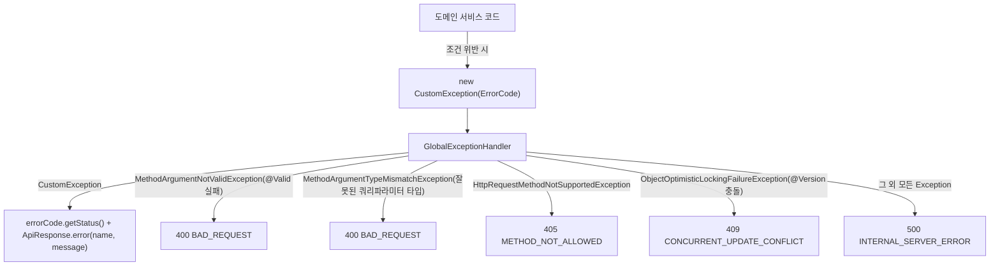

# 공통 구조 (global)

## 레이어드 구조

각 도메인(`domain/{도메인명}`)은 동일한 레이어 구조를 따른다.

```
domain/{도메인명}
 ├─ controller   # HTTP 요청/응답 (엔드포인트)
 ├─ service      # 비즈니스 로직
 ├─ repository   # DB 접근 (Spring Data JPA / QueryDSL)
 ├─ entity       # DB 테이블과 매핑되는 JPA 엔티티
 ├─ dto          # 요청/응답 데이터 객체
 └─ enums        # 도메인 상태값
```

여러 도메인에 걸친 것(보안, JWT, 예외 처리, 공통 응답, 메일, 이벤트, Swagger 설정 등)은 `global/` 아래에 있다.

## 공통 응답 (`ApiResponse<T>`)

모든 API는 `ApiResponse<T>`로 감싸 응답한다.

```json
{ "success": true, "data": { "...": "..." }, "code": null, "message": "성공" }
```

- 성공: `ApiResponse.success(data)`
- 실패: `ApiResponse.error(code, message)` — `code`는 에러코드 enum의 `name()`

## 에러 처리 체계



- `ErrorCode` 인터페이스(`getStatus()`, `getMessage()`, `name()`)를 도메인별 enum(`CommonErrorCode`, `MemberErrorCode`, `AdminErrorCode`, `AuthErrorCode`, `SubscriptionErrorCode` 등)이 구현한다. 도메인마다 별도 enum을 두되, 한 enum 안에 그 도메인과 관련된 여러 에러가 섞여 있는 구조다(엔드포인트 1:1 매핑이 아님).
- `CustomException`은 `ErrorCode`를 감싸는 런타임 예외 하나로 모든 비즈니스 예외를 표현한다. 도메인마다 예외 클래스를 새로 만들지 않는다.
- `MethodArgumentTypeMismatchException` 핸들러는 `status=WRONG_VALUE`처럼 enum 쿼리 파라미터에 정의되지 않은 값이 들어왔을 때, 처리하지 않으면 500으로 떨어지는 걸 400으로 바꿔준다(전역 공통, 특정 도메인 전용 아님).

## 인가(Authorization) 방식 - 두 겹 구조

`SecurityConfig`는 `/api/admin/**`만 `hasRole("ADMIN")`으로 명시적으로 막고, 나머지 전체 경로(`/**`)는 `permitAll()`이다. 즉 "로그인 필요"는 Spring Security 규칙표가 아니라 **컨트롤러 메서드 안에서 개별적으로** 강제된다.

```java
Long memberId = AuthenticationHelper.resolveMemberId(authentication);
```

- 토큰이 없거나 무효하면 `JwtAuthFilter`가 `SecurityContext`를 채우지 않고, Spring Security가 대신 principal이 문자열 `"anonymousUser"`인 익명 인증을 채운다.
- 이 상태에서 `(Long) authentication.getPrincipal()`로 바로 캐스팅하면 `ClassCastException`이 `GlobalExceptionHandler`의 500 처리로 떨어져 버그처럼 보인다.
- `AuthenticationHelper.resolveMemberId()`가 이 캐스팅을 감싸서, principal이 `Long`이 아니면 `CommonErrorCode.UNAUTHORIZED`(401)를 던지도록 통일했다. **로그인이 필요한 컨트롤러 메서드는 전부 이 헬퍼를 통해 회원 ID를 꺼낸다.**

## Swagger 에러코드 자동 문서화

에러코드 enum이 "도메인별"이 아니라 "여러 관심사가 섞인" 구조라서, 에러코드 클래스를 통째로 참조하는 방식(`Class<? extends Enum<?>>[]`)은 관련 없는 에러코드까지 노출돼 버린다. 대신 문자열 기반으로 개별 코드를 선택하고, 오타는 별도 테스트로 잡는다.

```java
@Operation(summary = "회원 상태 변경")
@ApiErrorCodes({"MEMBER_NOT_FOUND", "INVALID_TARGET_STATUS", "ALREADY_DELETED_MEMBER"})
@PatchMapping("/members/{memberId}/status")
```

- `ErrorCodeRegistry`가 `ClassPathScanningCandidateComponentProvider`로 `ErrorCode`를 구현한 모든 enum을 클래스패스에서 자동 스캔해 수집한다 — 새 에러코드 enum을 추가해도 수동 등록이 필요 없다.
- `SwaggerConfig`의 `OperationCustomizer`가 `@ApiErrorCodes` 값을 HTTP 상태코드별로 그룹핑해 OpenAPI 응답 예시로 주입한다.
- `ApiErrorCodesConsistencyTest`(reflections 기반)가 `@ApiErrorCodes`에 적은 문자열이 실제 `ErrorCodeRegistry`에서 resolve되는지 테스트로 검증해 오타를 잡는다.

## 트랜잭션 커밋 이후 부수효과 (`AfterCommitTask`)

Redis 쓰기(refresh token 저장/삭제, access token 블랙리스트 등록)처럼 롤백이 안 되는 외부 시스템 작업은, DB 트랜잭션이 실제로 커밋된 뒤에만 실행돼야 한다. 그렇지 않으면 트랜잭션이 롤백돼도 이미 Redis에는 반영된 상태로 남는 불일치가 생긴다.

```java
eventPublisher.publishEvent(new AfterCommitTask(this, () -> {
    tokenBlacklistService.invalidateTokensIssuedBefore(memberId, Instant.now());
    refreshTokenService.delete(memberId);
}));
```

`AfterCommitTask`는 `ApplicationEvent`를 감싼 래퍼이고, 리스너가 `TransactionPhase.AFTER_COMMIT` 시점에 `task.run()`을 실행한다. 트랜잭션이 롤백되면 이 이벤트의 `task`는 아예 실행되지 않는다.
