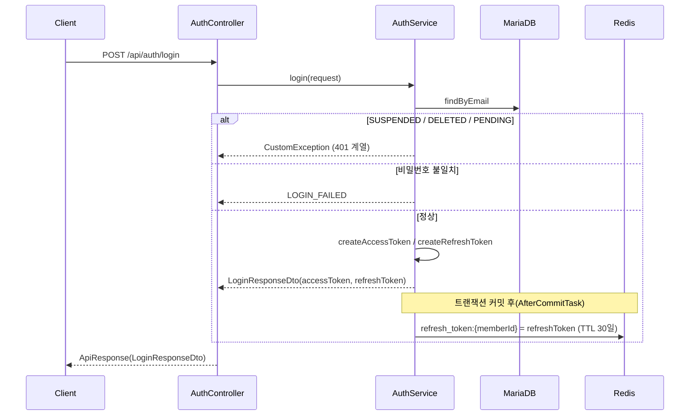
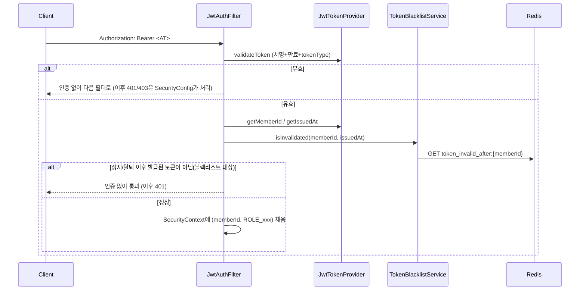

# 인증 / JWT (auth + global/jwt)

## 토큰 구조

`com.auth0:java-jwt` 기반 HMAC256 서명. `JwtTokenProvider`가 생성/검증을 전담한다.

| | Access Token | Refresh Token |
| --- | --- | --- |
| 용도 | 매 요청 인증 | Access Token 재발급 |
| subject | 회원 ID | 회원 ID |
| 클레임 | `role`, `tokenType=access` | `tokenType=refresh` (role 없음) |
| 유효기간 | 1시간(`jwt.access-token-expiration`) | 30일(`jwt.refresh-token-expiration`) |
| 검증 시 | 서명 + 만료 + `tokenType=access` | 서명 + 만료 + `tokenType=refresh` |

`tokenType` 클레임을 검증에 포함시켜서, refresh token을 access token 자리에 넣는(혹은 반대) 오용을 막는다.

## 로그인 흐름



`login()`은 비밀번호 대조 **전에** 회원 상태(SUSPENDED/DELETED/PENDING)부터 검사한다 — 어차피 로그인을 막을 거라면 비밀번호 채점 자체가 불필요한 작업이기 때문.

## 요청 인증 흐름 (매 요청)



- `JwtAuthFilter`는 예외를 던지지 않는다 — 인증에 실패하면 그냥 `SecurityContext`를 비워두고 다음 필터로 넘긴다. 실제 401/403 응답은 `SecurityConfig`의 `RestAuthenticationEntryPoint`/`RestAccessDeniedHandler`가 만든다.
- `/api/admin/**` 외의 모든 경로는 `permitAll()`이라, "로그인 필요"는 필터가 아니라 각 컨트롤러가 `AuthenticationHelper.resolveMemberId()`로 강제한다. ([01-common-structure.md](./01-common-structure.md) 참고)

## Redis 기반 토큰 관리 - 화이트리스트 + 블랙리스트 두 축

### `RefreshTokenService` - refresh token 화이트리스트

```java
key = "refresh_token:" + memberId  // value = 최신 refresh token, TTL = 30일
```

- 회원당 refresh token을 **1개만** 유효하다고 취급한다. 로그인할 때마다 덮어쓰므로, 다른 기기에서 새로 로그인하면 이전 기기의 refresh token은 자동으로 무효화된다(멀티 디바이스 동시 로그인 미지원).
- 재발급(`/api/auth/token-refresh`) 시 클라이언트가 보낸 refresh token이 여기 저장된 값과 정확히 일치하는지까지 확인한다 — 탈취된 옛 refresh token 재사용을 막는다.
- 로그아웃 시 즉시 삭제.

### `TokenBlacklistService` - access token 블랙리스트

```java
key = "token_invalid_after:" + memberId  // value = 무효 기준 시각(epoch ms), TTL = access token 최대 수명(1시간)
```

Refresh token과 달리 access token은 화이트리스트로 관리하지 않는다(요청마다 발급된 토큰 원문을 대조하려면 저장/비교 비용이 더 크다). 대신 **"이 시각 이전에 발급된 토큰은 전부 무효"** 라는 커트라인만 회원별로 하나 기록한다.

- 회원이 다시 `ACTIVE`가 돼도 커트라인을 따로 지울 필요가 없다 — 재활성화 이후 새로 발급되는 토큰은 자연히 `issuedAt`이 커트라인보다 늦어서 통과한다.
- TTL을 access token 최대 수명으로만 잡는 이유: 그 시간이 지나면 커트라인 이전에 발급된 토큰은 전부 자체 만료라 이 기록을 계속 들고 있을 필요가 없다.

이 블랙리스트를 채우는 지점(4곳)은 [03-member.md](./03-member.md), [05-admin.md](./05-admin.md)에서 각각 설명한다.

## 그 외 auth 기능

- **회원가입**: 생년월일로 연령대를 계산해 만 14세 미만(`MINOR_U14`)은 `PENDING`(보호자 동의 대기)으로, 그 외는 `ACTIVE`로 즉시 가입 처리하고 로그인과 동일하게 토큰을 함께 발급한다.
- **비밀번호 재설정**: 로그인 토큰과 별개로 `ActionTokenProvider`가 발급하는 목적 한정 토큰(`purpose=PASSWORD_RESET`, TTL 30분)을 쓴다. 토큰 발급 시점의 비밀번호 해시 지문(`pwv` 클레임)을 같이 넣어서, 토큰을 한 번 쓰고 나면(비밀번호가 바뀌면) 같은 토큰을 재사용(replay)할 수 없게 한다 — 사용 여부를 DB에 별도로 기록하지 않고도 재사용 방지가 된다.

## 관련 파일

- `domain/auth/service/AuthService.java`, `domain/auth/controller/AuthController.java`
- `global/jwt/JwtTokenProvider.java`, `JwtAuthFilter.java`, `RefreshTokenService.java`, `TokenBlacklistService.java`, `ActionTokenProvider.java`
- `global/config/SecurityConfig.java`
- `global/security/AuthenticationHelper.java`, `RestAuthenticationEntryPoint.java`, `RestAccessDeniedHandler.java`
