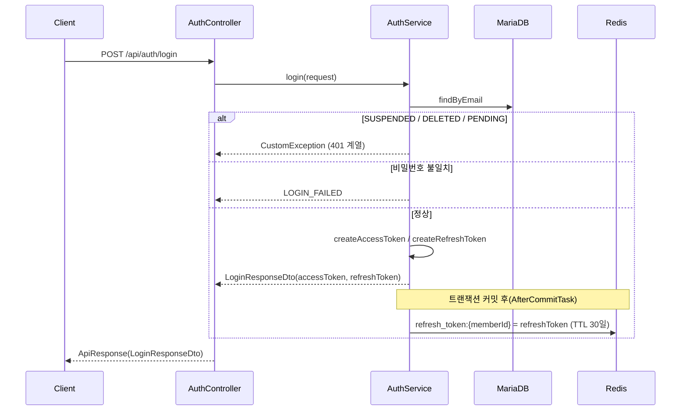
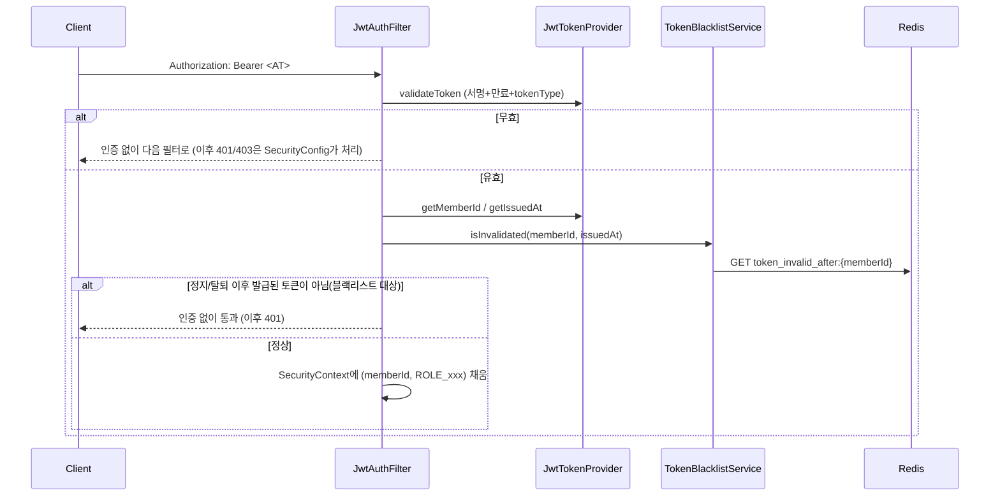
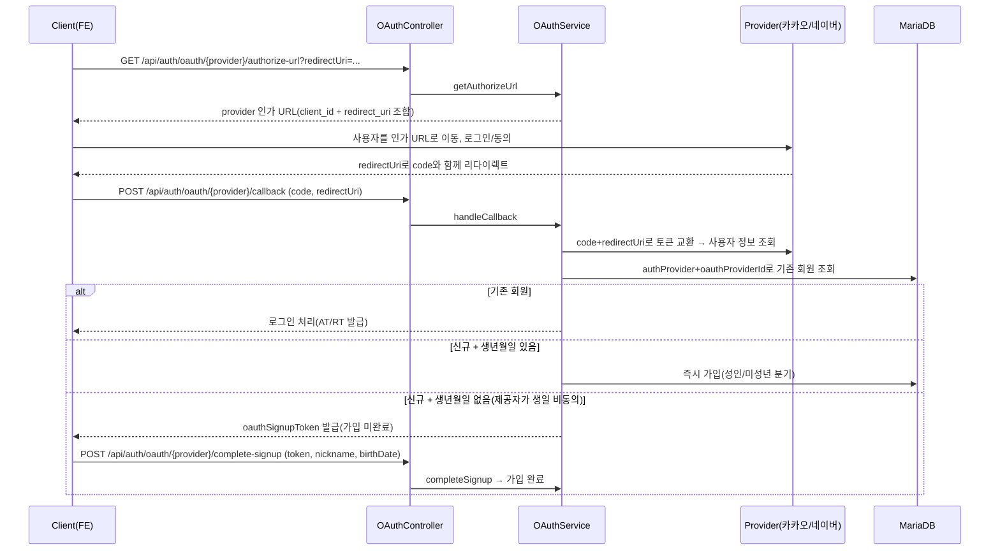

# 인증 / JWT (auth + global/jwt)

## 토큰 구조

`com.auth0:java-jwt` 기반 HMAC256 서명. `JwtTokenProvider`가 생성/검증을 전담한다.

| | Access Token | Refresh Token |
| --- | --- | --- |
| 용도 | 매 요청 인증 | Access Token 재발급 |
| subject | 회원 ID | 회원 ID |
| 클레임 | `role`, `tokenType=access` | `tokenType=refresh` (role 없음) |
| 유효기간 | 1시간(`jwt.access-token-expiration`) | 30일(`jwt.refresh-token-expiration`) |
| 검증 시 | 서명 + 만료 + `tokenType=access` | 서명 + 만료 + `tokenType=refresh` |

`tokenType` 클레임을 검증에 포함시켜서, refresh token을 access token 자리에 넣는(혹은 반대) 오용을 막는다.

## 로그인 흐름



`login()`은 비밀번호 대조 **전에** 회원 상태(SUSPENDED/DELETED/PENDING)부터 검사한다 — 어차피 로그인을 막을 거라면 비밀번호 채점 자체가 불필요한 작업이기 때문.

## 요청 인증 흐름 (매 요청)



- `JwtAuthFilter`는 예외를 던지지 않는다 — 인증에 실패하면 그냥 `SecurityContext`를 비워두고 다음 필터로 넘긴다. 실제 401/403 응답은 `SecurityConfig`의 `RestAuthenticationEntryPoint`/`RestAccessDeniedHandler`가 만든다.
- `/api/admin/**` 외의 모든 경로는 `permitAll()`이라, "로그인 필요"는 필터가 아니라 각 컨트롤러가 `AuthenticationHelper.resolveMemberId()`로 강제한다. ([01-common-structure.md](./01-common-structure.md) 참고)

## Redis 기반 토큰 관리 - 화이트리스트 + 블랙리스트 두 축

### `RefreshTokenService` - refresh token 화이트리스트

```java
key = "refresh_token:" + memberId  // value = 최신 refresh token, TTL = 30일
```

- 회원당 refresh token을 **1개만** 유효하다고 취급한다. 로그인할 때마다 덮어쓰므로, 다른 기기에서 새로 로그인하면 이전 기기의 refresh token은 자동으로 무효화된다(멀티 디바이스 동시 로그인 미지원).
- 재발급(`/api/auth/token-refresh`) 시 클라이언트가 보낸 refresh token이 여기 저장된 값과 정확히 일치하는지까지 확인한다 — 탈취된 옛 refresh token 재사용을 막는다.
- 로그아웃 시 즉시 삭제.

### `TokenBlacklistService` - access token 블랙리스트

```java
key = "token_invalid_after:" + memberId  // value = 무효 기준 시각(epoch ms), TTL = access token 최대 수명(1시간)
```

Refresh token과 달리 access token은 화이트리스트로 관리하지 않는다(요청마다 발급된 토큰 원문을 대조하려면 저장/비교 비용이 더 크다). 대신 **"이 시각 이전에 발급된 토큰은 전부 무효"** 라는 커트라인만 회원별로 하나 기록한다.

- 회원이 다시 `ACTIVE`가 돼도 커트라인을 따로 지울 필요가 없다 — 재활성화 이후 새로 발급되는 토큰은 자연히 `issuedAt`이 커트라인보다 늦어서 통과한다.
- TTL을 access token 최대 수명으로만 잡는 이유: 그 시간이 지나면 커트라인 이전에 발급된 토큰은 전부 자체 만료라 이 기록을 계속 들고 있을 필요가 없다.

이 블랙리스트를 채우는 지점(4곳)은 [03-member.md](./03-member.md), [05-admin.md](./05-admin.md)에서 각각 설명한다.

## 소셜 로그인 (OAuth — 카카오/네이버)

이메일 로그인(`AuthService`)과 별개 서비스(`OAuthService`)로 분리했다 — 인가 URL 생성, provider별 토큰 교환/사용자 정보 조회, 생년월일 미제공 시 2단계 가입처럼 이메일 로그인엔 없는 흐름이 대부분이라서다.



- **`redirectUri`는 프론트가 결정해서 매 요청 실어 보낸다** — 백엔드는 하드코딩된 콜백 경로가 없다. `authorize-url` 발급 때 넘긴 값과 `callback` 때 넘긴 값이 반드시 같아야 하고(`OAuthCallbackRequestDto` 문서 참고), 이 값은 카카오 디벨로퍼스/네이버 개발자센터에 **등록된 Redirect URI/Callback URL과도 정확히 일치**해야 한다(프로토콜 http/https, 트레일링 슬래시까지). 안 맞으면 provider가 콜백 자체를 거부한다.
- **`OAuthClientResolver`**가 path variable `provider`(`kakao`/`naver`) 문자열을 `AuthProvider` enum으로 변환하고, 해당하는 `OAuthClient` 구현체(`KakaoOAuthClient`/`NaverOAuthClient`)를 찾아준다. 지원하지 않는 값이면 `UNSUPPORTED_OAUTH_PROVIDER`.
- **`requireConfigured()`**: `KAKAO_CLIENT_ID`(카카오, Secret은 콘솔에서 활성화한 경우만 필수) / `NAVER_CLIENT_ID`+`NAVER_CLIENT_SECRET`(네이버는 둘 다 항상 필수)이 비어있으면 provider 서버까지 요청을 보내지 않고 바로 `OAUTH_NOT_CONFIGURED`(503)로 막는다. 값이 없어도 서버 자체는 정상 기동한다(`oauth.kakao.client-id` 등 기본값이 빈 문자열) — 소셜 로그인은 선택 기능이라 서버 기동을 막을 정도는 아니라는 설계. 환경변수 항목은 [09-deployment-config.md](./09-deployment-config.md) 참고.
- **이메일 필수**: provider가 이메일을 안 주면(사용자가 이메일 제공에 미동의) `OAUTH_EMAIL_REQUIRED`로 막는다 — 이메일이 `Member.email`의 유일한 식별자라 없으면 계정을 만들 수 없다.
- **회원 매칭 키**: `email`이 아니라 `(authProvider, oauthProviderId)` 조합으로 기존 회원을 찾는다. 같은 이메일이어도 카카오/네이버 계정을 별개로 취급한다(이메일이 같다고 자동 연동하지 않음).
- **가입 시 비밀번호**: 소셜 계정은 비밀번호로 로그인할 일이 없지만 컬럼이 `NOT NULL`이라, 랜덤 UUID를 해시해서 채운다 — 나중에 이메일/비밀번호 로그인을 시도해도 "그냥 비밀번호 틀림"으로 자연스럽게 막힌다.
- **닉네임 처리가 가입 경로마다 다르다**: 콜백에서 바로 가입되는 경로(생년월일 있음)는 사용자가 닉네임을 고칠 기회가 없어서 `sanitizeNickname`(특수문자 제거, 2~10자)으로 다듬고 중복되면 임의 숫자를 붙여(`resolveUniqueNickname`) 자동 확정한다. `complete-signup` 경로는 사용자가 직접 입력한 닉네임을 그대로 쓴다(중복이면 `DUPLICATE_NICKNAME`으로 막고 재입력 요구).
- **미성년(14세 미만) 분기**: 이메일 가입과 동일하게 `PENDING` 상태로 만들어지고 보호자 동의가 필요하다([03-member.md](./03-member.md) 참고). 콜백 즉시가입/2단계가입 둘 다 같은 규칙(`resolveInitialStatus`)을 탄다.
- **기존 회원 로그인 시 상태 게이트**: `SUSPENDED`/`DELETED`/`PENDING`이면 이메일 로그인(`AuthService.login`)과 동일한 에러 코드로 막는다(`loginExisting`).
- **네이버 CSRF `state`**: 네이버 콜백 계약이 `code`/`redirectUri`만 돌려주고 `state`를 안 돌려줘서, 매번 새로 생성만 하고 왕복 검증은 하지 않는다(왕복 검증하려면 콜백 계약에 `state` 필드 추가 필요 — 알려진 한계).

## 그 외 auth 기능

- **회원가입**: 생년월일로 연령대를 계산해 만 14세 미만(`MINOR_U14`)은 `PENDING`(보호자 동의 대기)으로, 그 외는 `ACTIVE`로 즉시 가입 처리하고 로그인과 동일하게 토큰을 함께 발급한다.
- **비밀번호 재설정**: 로그인 토큰과 별개로 `ActionTokenProvider`가 발급하는 목적 한정 토큰(`purpose=PASSWORD_RESET`, TTL 30분)을 쓴다. 토큰 발급 시점의 비밀번호 해시 지문(`pwv` 클레임)을 같이 넣어서, 토큰을 한 번 쓰고 나면(비밀번호가 바뀌면) 같은 토큰을 재사용(replay)할 수 없게 한다 — 사용 여부를 DB에 별도로 기록하지 않고도 재사용 방지가 된다.

## 관련 파일

- `domain/auth/service/AuthService.java`, `OAuthService.java`, `domain/auth/controller/AuthController.java`, `OAuthController.java`
- `domain/auth/oauth/OAuthClient.java`, `OAuthClientResolver.java`, `KakaoOAuthClient.java`, `NaverOAuthClient.java`, `KakaoOAuthProperties.java`, `NaverOAuthProperties.java`
- `domain/auth/exception/AuthErrorCode.java`
- `global/jwt/JwtTokenProvider.java`, `JwtAuthFilter.java`, `RefreshTokenService.java`, `TokenBlacklistService.java`, `ActionTokenProvider.java`
- `global/config/SecurityConfig.java`
- `global/security/AuthenticationHelper.java`, `RestAuthenticationEntryPoint.java`, `RestAccessDeniedHandler.java`
