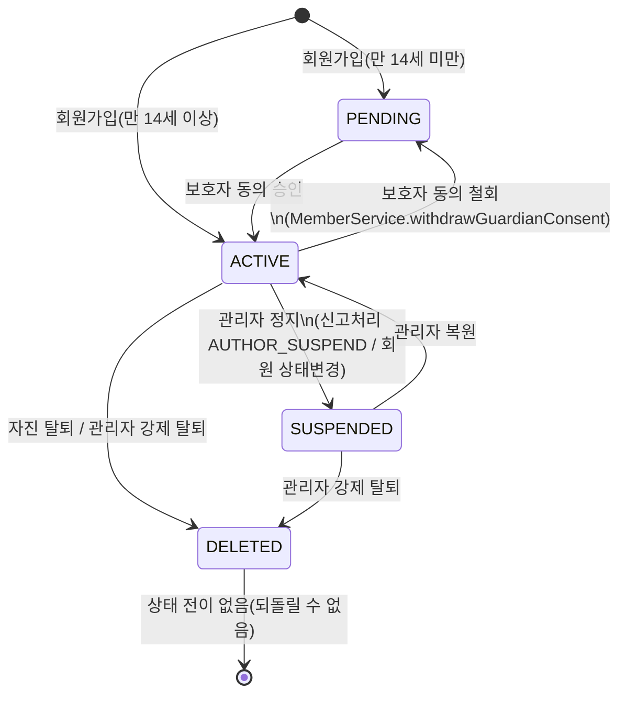
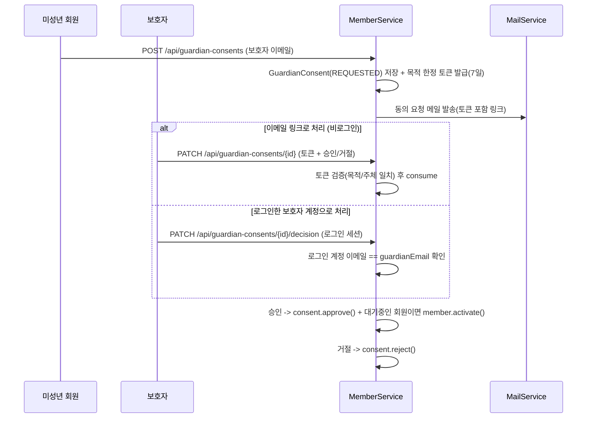

# 회원 (member)

## 상태 전이 (`MemberStatus`)

- `DELETED`는 되돌릴 수 없는 종단 상태로 취급한다. `AdminService`/`MemberService` 양쪽 모두 대상이 이미 `DELETED`면 `MemberErrorCode.ALREADY_DELETED_MEMBER`로 막는다.
- `PENDING`으로의 전환은 "보호자 동의 대기" 의미 하나뿐이라, 관리자 회원 상태 변경 API로는 이 상태로 보낼 수 없게 막아뒀다([05-admin.md](./05-admin.md) 참고).
- `SUSPENDED`/`DELETED`로 바뀔 때마다 [02-auth-jwt.md](./02-auth-jwt.md)의 access token 블랙리스트 + refresh token 삭제가 함께 실행돼, 이미 로그인된 세션도 즉시 끊긴다. 트리거 지점 4곳: 관리자 신고처리(`AUTHOR_SUSPEND`), 관리자 회원 상태변경, 보호자 동의 철회(`ACTIVE`→`PENDING`), 자진 탈퇴.

## 보호자 동의(만 14세 미만) 흐름

회원가입 시 생년월일로 계산한 나이가 14세 미만이면 `PENDING`으로 가입되고, 보호자가 동의해야 `ACTIVE`로 전환된다. 동의 처리 경로가 두 가지다.

- 만료된(`expiresAt` 지난) `REQUESTED` 건은 처리 시도 시점에 `EXPIRED`로 전환하고 에러를 반환한다(배치가 아니라 조회/처리 시점에 지연 평가).
- 승인 후 보호자가 동의를 철회하면(`withdrawGuardianConsent`), 대상 회원이 `ACTIVE`였을 경우에만 `PENDING`으로 되돌린다 — 이미 `SUSPENDED`/`DELETED`인 회원까지 되돌리지 않는다.

## 낙관적 락 (`@Version`)

`Member`에는 구독 시작/전환/해지/재개/자동갱신, 상태 변경(정지/탈퇴/복원), 무료체험 소진처럼 같은 회원 row를 동시에 읽고 쓸 수 있는 흐름(API 중복 호출, 배치와 API 동시 실행, 관리자 처리와 회원 요청 동시 발생 등)을 보호하기 위한 `@Version`이 걸려 있다. 충돌 시 나중에 커밋을 시도한 쪽이 `ObjectOptimisticLockingFailureException`(409)으로 걸린다.

### 재시도(`MemberOptimisticRetrySupport`)

프로필/뷰어설정/닉네임 변경, 구독 전환/해지/재개, 무료체험 소진처럼 **사용자가 명시적으로 요청한 변경**은 충돌 났다고 그냥 409를 돌려주면 방금 입력한 값이 사라진 것처럼 보인다(`reconcileIfExpired`처럼 "충돌 나면 포기해도 되는" 로직과는 다르다). `MemberOptimisticRetrySupport.saveWithRetry(memberId, mutator)`가 이런 흐름에서 409를 사용자에게 노출하지 않고 서버가 대신 재시도한다.

- 호출부는 대부분 클래스 레벨 `@Transactional` 서비스 메서드 안에서 이걸 부르는데, 그 트랜잭션을 그대로 쓰면서 재시도하면 레포지토리 저장 자체가 트랜잭션 경계라 첫 실패 시점에 물리 트랜잭션이 rollback-only로 마킹되어 이후 재시도가 겉보기엔 성공해도 커밋 시점에 통째로 롤백된다. 그래서 `TransactionTemplate` + `PROPAGATION_REQUIRES_NEW`로 시도마다(최대 3회) 완전히 독립된 트랜잭션을 새로 열고, 매번 `findById`로 최신 행을 다시 읽는다.
- `mutator`는 재시도마다 최신 `Member`에 다시 적용되므로, 재시도 시점까지도 유효해야 하는 전제 조건(닉네임 중복, 이미 프리미엄인지 등)이 있으면 mutator 안에서 매번 다시 검사해야 한다 — 바깥에서 한 번만 검사하면 재시도 사이에 바뀐 상태를 놓친다.

엔티티 전체가 아니라 **필드 단위로 락 적용 여부를 나눴다**(Hibernate `@OptimisticLock(excluded = true)`).

| 락 대상 (버전 증가 O) | 제외 (버전 증가 X) |
| --- | --- |
| `status`, `withdrawnAt`, `freeTrialUsed` | `email`, `password`, `birthDate`, `nickname` |
| `subscriptionPlan`, `subscriptionStartAt/EndAt`, `subscriptionAutoRenew` | `profileImageUrl`, `introduction`, `role` |
| `dailyTextRemaining`, `dailyImageRemaining`, `lastTokenResetDate` | `viewerFontSize`, `viewerViewType` |

기준: **동시에 수정될 때 실제로 데이터가 꼬일 수 있는 필드만 락에 남긴다.** 닉네임 수정과 프로필 이미지 변경이 동시에 일어나도 손실 갱신 정도로 끝나지만, 상태(`status`)나 구독/한도 필드가 동시에 바뀌면(예: 관리자 정지 처리와 회원 탈퇴가 겹치는 경우) 애플리케이션 레벨 if문만으로는 레이스를 완전히 막지 못한다.

## 관련 파일

- `domain/member/entity/Member.java`, `GuardianConsent.java`
- `domain/member/service/MemberService.java`
- `domain/member/controller/MemberController.java`
- `domain/member/enums/MemberStatus.java`, `GuardianConsentStatus.java`
