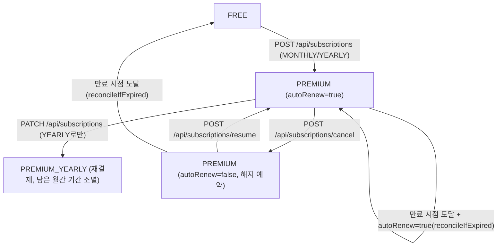
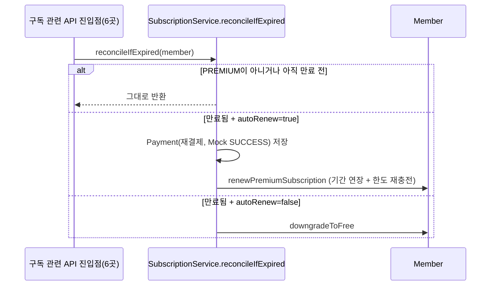

# 구독 / 결제 (subscription)

## 플랜 정책 (`SubscriptionPolicy`)

DB에 플랜 테이블을 따로 두지 않고 `domain/subscription/SubscriptionPolicy.java`의 정적 상수로 관리한다.

| PlanType | 가격 | 주기 | 일일 텍스트/이미지 한도 |
| --- | --- | --- | --- |
| `FREE` | 0원 | - | 없음(생애 1회 무료체험, 아래 참고) |
| `PREMIUM_MONTHLY` | 9,900원 | 30일 | 30 / 20 |
| `PREMIUM_YEARLY` | 99,000원(월 요금의 10개월치) | 365일 | 30 / 20 |

FREE 회원은 대신 **생애 1회, 책 1권(최대 10페이지)** 무료체험을 쓸 수 있고, 페이지 수와 별개로 텍스트 20회/이미지 15회의 생애 호출 상한이 있다(같은 페이지를 계속 재생성하며 원가만 나가는 것을 막기 위함).

## 결제는 Mock

실제 PG(토스 등) 연동 전이라, `SubscriptionService.chargeAndStartPremium()`은 서버 검증 없이 바로 `PaymentStatus.SUCCESS`로 처리한다. 금액은 클라이언트가 보낸 값을 신뢰하지 않고 서버가 `planType` 기준으로 다시 계산한다(`SubscriptionPolicy.priceOf`).

## 구독 상태 변화

- **연간→월간 다운그레이드는 지원하지 않는다** — 이미 결제한 잔여 기간을 환불 없이 날리는 셈이라 불공평하다고 판단. 해지 예약 후 만료를 기다렸다가 월간으로 재구독하는 흐름을 대신 쓴다.
- 해지 예약(`cancelSubscription`)은 즉시 FREE로 내리지 않고 `autoRenew=false`만 켠다 — 이미 결제한 기간(`subscriptionEndAt`)까지는 계속 PREMIUM 혜택을 준다.

## 만료 처리: "지연 정리(reconcile)" + 배치 이중 안전망

`subscriptionEndAt`이 지났는지는 배치가 하루에 한 번만 확인하기 때문에, 그 사이에 사용자가 구독 조회/변경 API를 호출하면 상태 필드(`subscriptionPlan`, `autoRenew`)와 실제 만료일이라는 두 진실 소스가 어긋날 수 있다. 그래서 `SubscriptionService.reconcileIfExpired(member)`를 **구독을 조회/변경하는 모든 진입점**(구독 조회, 구독/해지/재개, 사용량 조회, 텍스트/이미지 차감)에서 맨 먼저 호출해 그 자리에서 즉시 정리한다.

`SubscriptionScheduler`(매일 00:00, `@Scheduled(cron = "0 0 0 * * *")`)는 **API를 한 번도 안 부른 회원들을 위한 최종 안전망**이다. 배치와 API가 완전히 같은 규칙(`reconcileIfExpired`)을 그대로 재사용하므로 결과가 어긋나지 않는다. 배치는 이 정리 작업 외에, PREMIUM 회원의 일일 텍스트/이미지 한도를 매일 재충전하는 것도 같이 한다.

## 관련 API

| API | 설명 |
| --- | --- |
| `GET /api/subscription-plans` | 플랜 목록(정적) |
| `GET /api/subscriptions/me` | 내 구독 현황(진입 시 자동 reconcile) |
| `POST /api/subscriptions` | 신규 구독 시작(FREE → PREMIUM) |
| `PATCH /api/subscriptions` | 월간 → 연간 즉시 전환 |
| `POST /api/subscriptions/cancel` | 해지 예약 |
| `POST /api/subscriptions/resume` | 해지 예약 취소 |
| `GET /api/payments` | 결제 내역 조회(페이지네이션, 인보이스 표시용 마스킹된 값 포함) |
| `GET /api/usage/me` | 오늘 사용량(PREMIUM: 일일 잔여량 / FREE: 생애 체험 잔여 호출수) |

## 관련 파일

- `domain/subscription/SubscriptionPolicy.java`
- `domain/subscription/service/SubscriptionService.java`, `PaymentService.java`, `UsageService.java`
- `domain/subscription/scheduler/SubscriptionScheduler.java`
- `domain/subscription/controller/SubscriptionController.java`, `PaymentController.java`, `UsageController.java`
- `domain/subscription/entity/Payment.java`
