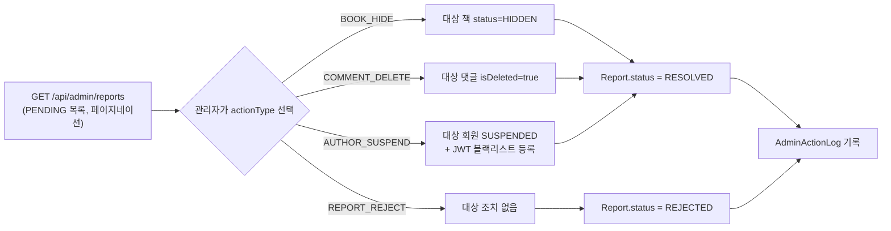

# 관리자 (admin)

`/api/admin/**`은 `SecurityConfig`에서 `hasRole("ADMIN")`으로 명시적으로 막혀 있는, 프로젝트에서 유일하게 Spring Security 규칙표로 인가를 강제하는 경로다(그 외는 [01-common-structure.md](./01-common-structure.md)의 컨트롤러 레벨 인가 방식을 따른다).

## 1. 신고 처리



- `target_id`는 `target_type`(`BOOK`/`COMMENT`/`AUTHOR`)에 따라 가리키는 테이블이 다른 폴리모픽 컬럼이라, FK 제약 없이 애플리케이션에서 `requireTargetType()`으로 정합성을 확인한다.
- `AUTHOR_SUSPEND`는 대상이 이미 `DELETED`면 막는다([03-member.md](./03-member.md)의 "되돌릴 수 없는 종단 상태" 참고).
- 처리 결과는 항상 `AdminActionLog`(누가/어떤 신고를/어떻게 처리했는지)로 남는다.

## 2. 회원 관리

| API | 설명 |
| --- | --- |
| `GET /api/admin/members?status=&keyword=&page=&size=` | 전체 회원 목록. `status`(`MemberStatus`) 필터, `keyword`는 이메일/닉네임 부분일치 검색 |
| `PATCH /api/admin/members/{memberId}/status` | 회원 상태 강제 변경(`ACTIVE`/`SUSPENDED`/`DELETED`만 허용) |

```mermaid
flowchart TD
    A["PATCH /api/admin/members/{id}/status"] --> B{"대상이 ADMIN 역할?"}
    B -->|예| C["403 ADMIN_STATUS_CHANGE_NOT_ALLOWED"]
    B -->|아니오| D{"targetStatus가 ACTIVE/SUSPENDED/DELETED?"}
    D -->|아니오\n(예: PENDING 지정)| E["400 INVALID_TARGET_STATUS"]
    D -->|예| F{"대상이 이미 DELETED?"}
    F -->|예| G["409 ALREADY_DELETED_MEMBER"]
    F -->|아니오| H["상태 전환 적용"]
    H -->|SUSPENDED/DELETED| I["JWT 블랙리스트 + refresh token 삭제\n(AfterCommitTask)"]
```

- **관리자 자기 자신/다른 관리자 계정은 이 API로 건드릴 수 없다** — 자기 자신을 정지시키거나 마지막 남은 관리자 계정을 잠가버리는 사고를 원천 차단.
- `PENDING`(보호자 동의 대기)으로의 전환은 허용하지 않는다 — 그건 회원가입/보호자 동의 흐름 전용 상태 전이라, 관리자가 임의로 지정하면 흐름이 꼬인다.
- `DELETED`로 바꾸면 구독도 함께 즉시 해지(`cancelSubscriptionImmediately`)한다.
- 상태 변경 사유(`reason`)는 로그로만 남기고 DB에 영속화하지 않는다 — `AdminActionLog.report_id`가 `NOT NULL`이라 이 API의 사유까지 재사용하려면 스키마 변경이 필요해서, 스키마 확장 없이 우선 `log.info`로만 남기는 쪽을 택했다.

## 관련 파일

- `domain/admin/controller/AdminApi.java`, `AdminController.java`
- `domain/admin/service/AdminService.java`
- `domain/admin/exception/AdminErrorCode.java`
- `domain/admin/entity/AdminActionLog.java`, `enums/AdminActionType.java`
- `domain/member/repository/MemberRepository.java` (`searchForAdmin` 쿼리)
