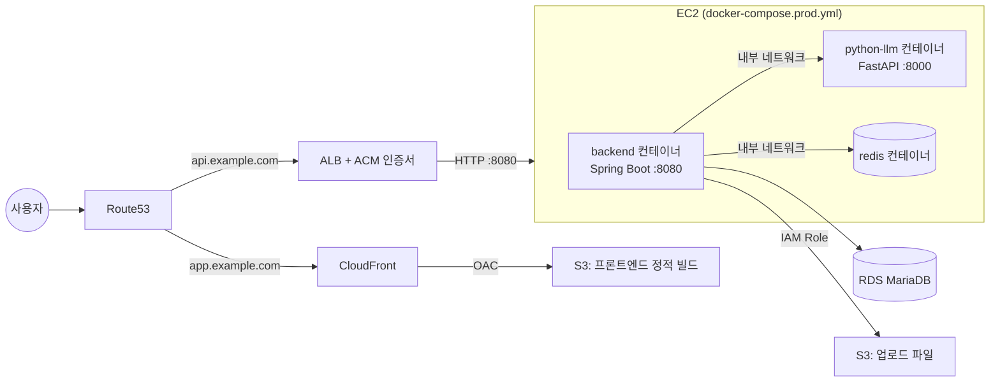
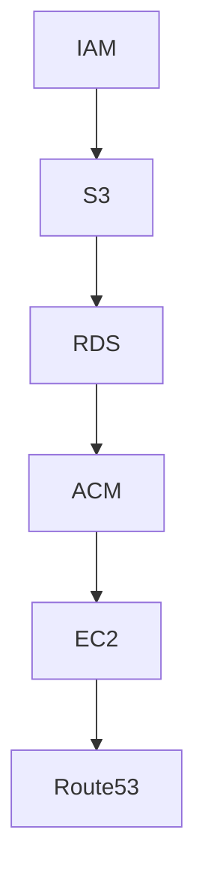

# 클라우드 배포 (AWS)

로컬/사내망이 아니라 실제 AWS 환경에 백엔드·프론트엔드를 올리는 절차. "무엇을 했는지"가 아니라 "어떤 순서로, 왜 그 순서로 해야 하는지"에 집중해서 정리한다. 실제 리소스 생성은 AWS 콘솔에서 직접 수행하고, 이 문서는 그 체크리스트 + 이 리포에 있는 배포용 파일(`Dockerfile`, `docker-compose.prod.yml`, `.env.prod.example`)이 어떻게 맞물리는지를 기록한다.

## 전체 아키텍처

핵심 결정 두 가지:
- **ACM 인증서는 EC2에 직접 설치할 수 없다.** ACM은 ALB/CloudFront 같은 AWS 관리형 서비스에만 붙일 수 있으므로, HTTPS 종료는 EC2 앞단의 **ALB**가 담당하고 EC2는 내부적으로 HTTP(8080)만 열어둔다. (Nginx+Certbot으로 EC2에서 직접 TLS를 받는 대안도 있지만, 이미 ACM을 쓰기로 했으므로 ALB 경로를 택함.)
- **S3 자격증명은 액세스 키로 넣지 않는다.** `application.yml`의 `app.s3` 설정 주석에도 명시되어 있듯, EC2에 IAM Role을 붙이면 AWS SDK(`DefaultCredentialsProvider`)가 인스턴스 메타데이터에서 자동으로 자격증명을 가져온다. 코드/환경변수 어디에도 액세스 키가 노출되지 않는다.

## 왜 이 서비스들인가 (개념)

AWS를 처음 접하면 이름만 보고는 서로 뭐가 다른지 헷갈리기 쉬워서, 각 서비스가 "왜 필요한지"를 하나씩 짚는다.

### IAM — 신원과 권한

AWS 안에서 "누가 무엇을 할 수 있는가"를 관리하는 서비스. 사람(IAM User)뿐 아니라 EC2 같은 리소스에도 **Role**이라는 형태로 권한을 부여할 수 있다.

- **Access Key 방식**: 발급받은 키(ID+Secret)를 코드나 환경변수에 박아넣는 방식. 키가 코드/로그/git history에 실수로 남으면 그대로 탈취당하고, 만료/로테이션도 사람이 직접 관리해야 한다.
- **IAM Role 방식(이 프로젝트가 쓰는 방식)**: 키를 아예 발급하지 않고, EC2 인스턴스 자체에 "이 인스턴스는 S3 버킷 X에 쓰기 가능"이라는 권한을 붙인다. AWS SDK가 인스턴스 메타데이터에서 임시 자격증명을 자동으로 받아오므로, 코드에는 "S3에 접근하는 로직"만 있고 "누구 자격으로 접근하는지"는 전혀 노출되지 않는다. `application.yml`이 `DefaultCredentialsProvider`를 쓰도록 이미 짜여 있는 이유가 이것.

### S3 — 객체 스토리지

파일(이미지, 정적 HTML/JS/CSS 등)을 저장하는 서비스. 이 프로젝트에서는 두 가지 다른 목적으로 쓴다.

- 백엔드 업로드 파일 저장소로서의 S3 (프로필 사진, AI 생성 이미지)
- 프론트엔드 빌드 산출물(정적 파일) 저장소로서의 S3 — 이 경우 S3 자체는 "그냥 파일 창고"이고, 실제로 사용자에게 서빙하는 건 CloudFront가 담당한다(아래 참고).

버킷을 2개로 나누는 이유: 성격이 다른 데이터(사용자 업로드 vs 빌드 산출물)를 섞으면 권한 관리·배포 파이프라인이 꼬인다. 프론트 빌드는 배포할 때마다 통째로 갈아끼우는 대상이라 백엔드 업로드 파일과 라이프사이클이 다르다.

### RDS — 관리형 관계형 DB

MariaDB를 직접 EC2에 설치해서 운영할 수도 있지만, RDS를 쓰면 백업/패치/장애 복구를 AWS가 대신 처리해준다. EC2와 분리해서 두는 이유는 **DB와 애플리케이션 서버의 생명주기를 독립적으로 관리**하기 위함 — EC2를 재기동/교체해도 데이터는 RDS에 그대로 남는다.

퍼블릭 액세스를 막고 EC2 보안그룹에서만 접근을 허용하는 건, DB가 인터넷에 직접 노출되면 그 자체로 가장 위험한 공격 표면이 되기 때문이다(브루트포스, 취약점 스캔의 1순위 타깃).

### CloudFront — CDN (콘텐츠 전송 네트워크)

S3에 있는 정적 파일을 전 세계 엣지 로케이션에 캐싱해서, 사용자와 가까운 위치에서 빠르게 응답하는 서비스. S3를 직접 공개해서 서빙할 수도 있지만 그러면:
- HTTPS를 붙이려면 S3 자체 기능만으론 안 되고(S3 정적 웹 호스팅은 HTTP만 지원), CloudFront가 ACM 인증서를 붙여 HTTPS를 제공한다.
- 매 요청이 S3까지 직접 가는 대신 캐싱되어 더 빠르고 S3 요청 비용도 절감된다.

**OAC(Origin Access Control)**: CloudFront만 S3 버킷에 접근할 수 있게 제한하는 설정. 이게 없으면 S3 버킷 URL을 알아낸 사람이 CloudFront를 거치지 않고 버킷에 직접 접근할 수 있어서, "S3는 비공개 + CloudFront로만 노출"이라는 원칙이 깨진다.

### ACM — 인증서 관리

HTTPS에 필요한 TLS 인증서를 발급/갱신해주는 서비스. Let's Encrypt처럼 직접 서버에서 인증서를 관리(설치, 90일마다 수동/cron 갱신)하지 않아도, ACM이 발급한 인증서를 ALB나 CloudFront에 "붙이기"만 하면 되고 **갱신도 AWS가 자동으로 처리**한다.

단, ACM 인증서는 **AWS 관리형 서비스(ALB, CloudFront, API Gateway 등)에만 첨부 가능**하고 EC2 안의 Nginx 같은 일반 서버 프로세스에는 직접 설치할 수 없다(개인키를 export할 수 없는 구조). 그래서 EC2 앞에 ALB를 하나 더 두는 구조가 된다.

### ALB (Application Load Balancer)

이 문서의 아키텍처에서는 "로드밸런싱"보다 **"ACM 인증서를 붙일 수 있는 HTTPS 종료 지점"**으로서의 역할이 크다(인스턴스가 1대뿐이라도 ALB를 두는 이유). 사용자 → ALB(443, HTTPS) → EC2(8080, HTTP) 순으로 흐르고, 실제 TLS 암복호화는 ALB에서 끝난다. 인스턴스를 나중에 여러 대로 늘려도 ALB 뒤에 추가하기만 하면 되는 확장성도 덤으로 얻는다.

### Route53 — DNS

도메인 이름(`example.com`)을 실제 AWS 리소스(ALB, CloudFront)의 주소로 연결해주는 DNS 서비스. `A 레코드(Alias)`로 연결하면 IP를 직접 안 써도 AWS 리소스가 바뀌었을 때(예: ALB IP가 바뀌는 경우) 자동으로 최신 주소를 가리킨다.

### Docker / docker-compose — 왜 컨테이너로 배포하는가

"내 로컬에서는 되는데 서버에서는 안 된다" 문제(Java 버전, OS 라이브러리 차이 등)를 없애기 위해, 애플리케이션과 그 실행 환경(JRE, 라이브러리)을 이미지 하나로 묶는다. `Dockerfile`이 **멀티스테이지 빌드**를 쓰는 이유:

1. **build 스테이지**: JDK + gradle로 소스를 컴파일해서 war 파일을 만든다. 이 단계의 도구들(JDK, gradle 캐시)은 빌드에만 필요하고 운영에는 불필요하다.
2. **실행 스테이지**: 앞 단계에서 만들어진 war 파일만 가져와 JRE(더 가벼움) 위에서 실행한다.

이렇게 나누면 최종 이미지에 컴파일 도구가 남지 않아 이미지 용량이 작아지고, 공격 표면(불필요하게 설치된 도구)도 줄어든다.

`docker-compose.prod.yml`로 여러 컨테이너(backend, python-llm, redis)를 하나의 네트워크에 묶는 이유는, 컨테이너끼리 `localhost`가 아니라 **서비스 이름으로 서로를 찾을 수 있게** 하기 위함이다(도커의 내장 DNS). `FASTAPI_BASE_URL=http://python-llm:8000`이 되는 게 이 때문 — 같은 호스트(EC2)에 떠 있어도 컨테이너는 서로 격리된 네트워크 네임스페이스를 가지므로 `localhost`로는 서로에게 닿지 않는다.

## 진행 순서

의존 관계상 아래 순서가 자연스럽다 (뒤 단계가 앞 단계의 산출물을 필요로 함).

### 1. IAM

- [ ] EC2에 붙일 Role 생성 (예: `sangsangseoga-ec2-role`)
- [ ] 정책: 업로드용 S3 버킷 한정 `s3:PutObject` / `s3:GetObject` / `s3:DeleteObject`만 부여 (버킷 전체 권한 X, ARN으로 특정 버킷만 지정)
- [ ] Access Key는 절대 발급/저장하지 않는다 — Role은 EC2 생성 시점에 붙인다 (4단계에서 사용)

### 2. S3 (버킷 2개)

- [ ] `sangsangseoga-uploads` : 백엔드 업로드 파일용. 퍼블릭 액세스 차단 유지, CloudFront 또는 `S3_PUBLIC_BASE_URL`로만 서빙
- [ ] `sangsangseoga-frontend` : React 빌드 결과물(`dist/`)용. 정적 웹 호스팅 기능은 끄고 CloudFront Origin Access Control(OAC)로만 접근 허용 (버킷 직접 공개 금지)

### 3. RDS (MariaDB)

- [ ] EC2와 같은 VPC의 프라이빗 서브넷에 생성, **퍼블릭 액세스 비활성화**
- [ ] 보안그룹 인바운드: EC2 보안그룹에서 3306만 허용 (0.0.0.0/0 금지)
- [ ] 엔드포인트/유저명/비밀번호를 `.env.prod`의 `PROD_DB_HOST` / `PROD_DB_USERNAME` / `PROD_DB_PASSWORD`로 사용 (`application.yml`의 `prod` 프로파일이 그대로 읽음)
- [ ] 최초 기동 전 스키마/데이터가 필요하면 `dummy_data.sql` 등 반영 (prod는 `ddl-auto: validate`라 테이블을 미리 만들어둬야 함 — 자동 생성 안 됨)

### 4. ACM

- [ ] **ALB(api.example.com)용 인증서는 실제 리전(ap-northeast-2)**에서 발급
- [ ] **CloudFront(app.example.com)용 인증서는 반드시 us-east-1 리전**에서 발급 (다른 리전 인증서는 CloudFront에 붙지 않음 — 흔히 놓치는 부분)
- [ ] Route53에 도메인이 있으면 DNS 검증으로 몇 분 내 발급 가능

### 5. EC2

- [ ] 인스턴스 생성 시 1단계에서 만든 IAM Role 연결
- [ ] 보안그룹 인바운드: ALB 보안그룹에서 8080만 허용, SSH(22)는 관리자 IP만
- [ ] Docker, Docker Compose 설치
- [ ] 이 리포(`be`) + [`sangsangseoga-python`](https://github.com/KostaFinal/sangsangseoga-python) 리포를 EC2에 clone (`docker-compose.prod.yml`이 `../sangsangseoga-python` 상대 경로로 빌드하므로 두 리포를 같은 부모 디렉터리 아래 나란히 clone)
- [ ] `.env.prod.example`을 참고해 `.env.prod` 작성, `.env.python-llm.example`을 참고해 `.env.python-llm` 작성 (실제 비밀번호/키 채움, git에는 올리지 않음 — `.gitignore`에 이미 등록됨)
- [ ] `docker compose -f docker-compose.prod.yml up -d --build`
- [ ] ALB 생성 후 대상 그룹에 이 EC2를 8080 포트로 등록, 리스너에 4단계 ACM 인증서 연결 (443 → 8080)

### 6. Route53

- [ ] `api.example.com` → ALB로 향하는 A 레코드(Alias)
- [ ] `app.example.com` → CloudFront 배포로 향하는 A 레코드(Alias)

## 이 리포의 배포용 파일

| 파일 | 역할 |
| --- | --- |
| `Dockerfile` | 멀티스테이지 빌드(gradle build → JRE 실행). `war` 플러그인이 붙어 있지만 embedded Tomcat을 포함해 `java -jar`로 그대로 실행됨 |
| `docker-compose.prod.yml` | EC2에서 `backend` / `python-llm` / `redis`를 한 네트워크로 묶어 기동. `python-llm`은 외부 포트를 열지 않고 backend가 내부적으로만 호출 |
| `.env.prod.example` | EC2의 `.env.prod`(실제 값, git 미포함)에 어떤 키가 필요한지 보여주는 템플릿 |

`docker build`와 `docker run`으로 이미지 빌드 및 기동 자체는 로컬에서 검증 완료(DB 미연결로 인한 종료는 정상 — RDS 연결 시 해소됨).

## 트러블슈팅 메모

- **prod 기동 시 JPA 관련 예외로 죽는 경우**: `ddl-auto: validate`라 RDS에 테이블이 미리 없으면 실패한다. 스키마를 먼저 반영했는지 확인.
- **CloudFront에서 403/CORS 에러**: 버킷 정책이 OAC를 허용하는지, `S3_PUBLIC_BASE_URL`이 실제 CloudFront 도메인과 일치하는지 확인.
- **backend에서 파이썬 서버 호출 실패**: `FASTAPI_BASE_URL`이 `http://python-llm:8000`(서비스명)으로 설정됐는지 확인 — `localhost`를 쓰면 컨테이너 분리 환경에서는 연결되지 않는다.
