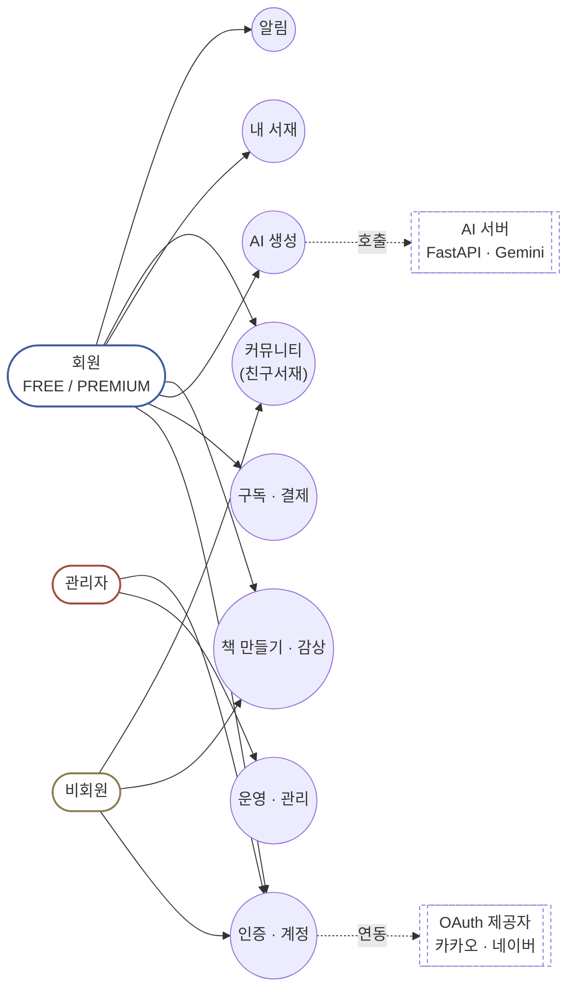
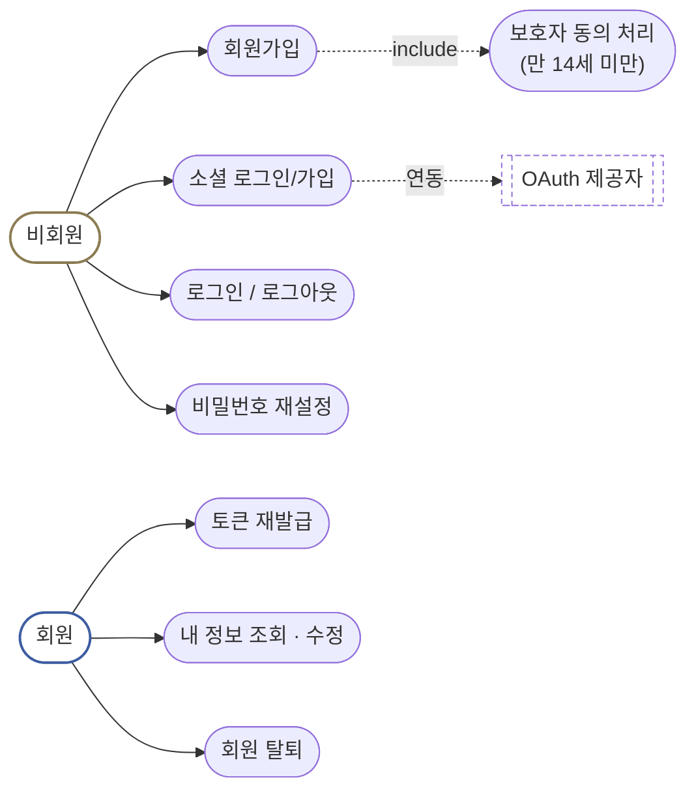
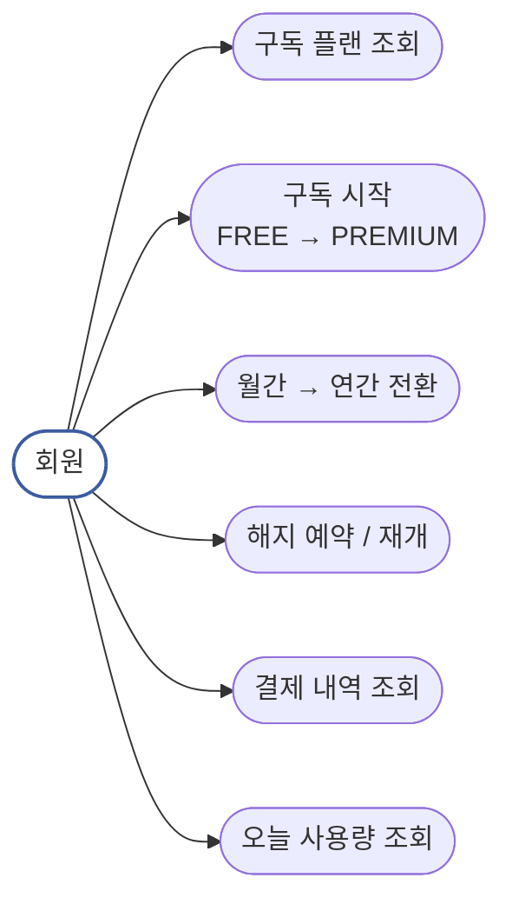
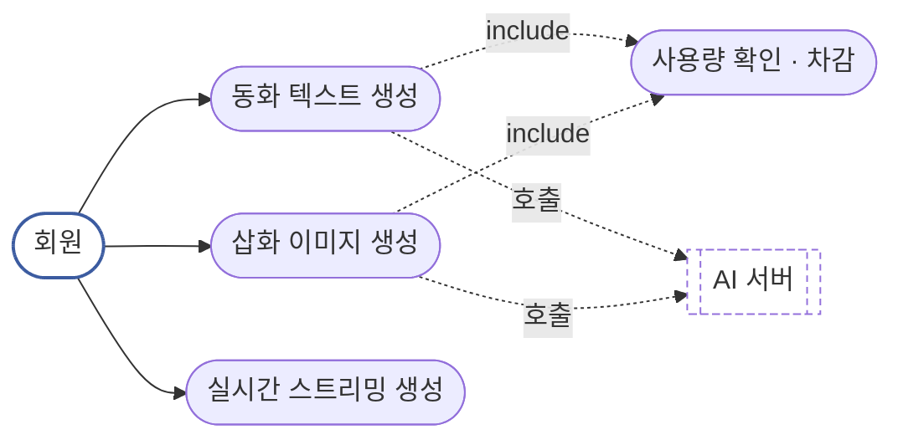
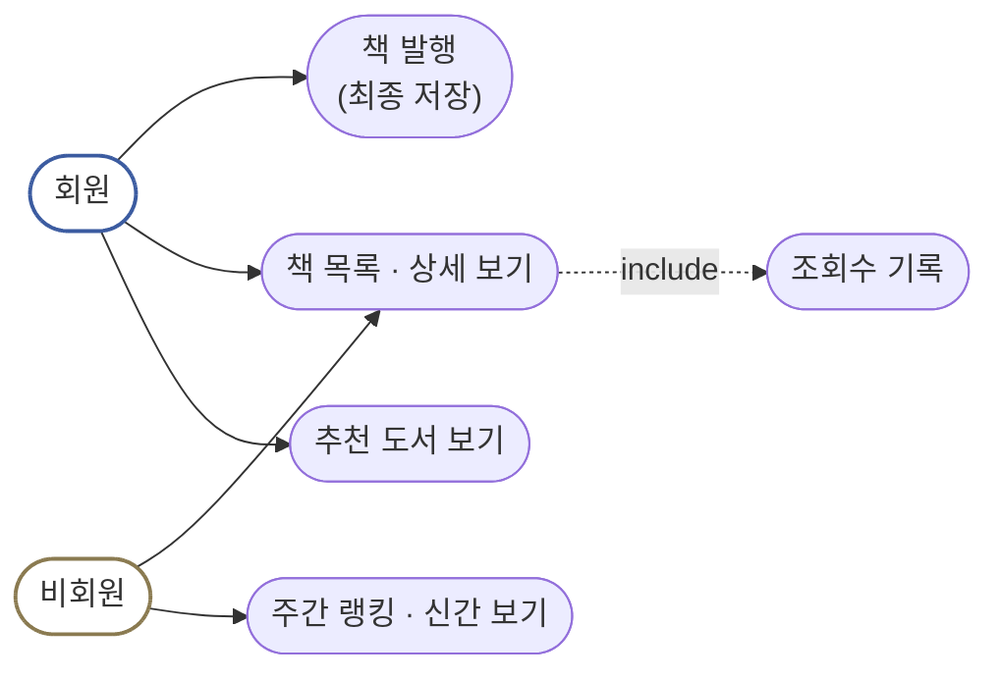
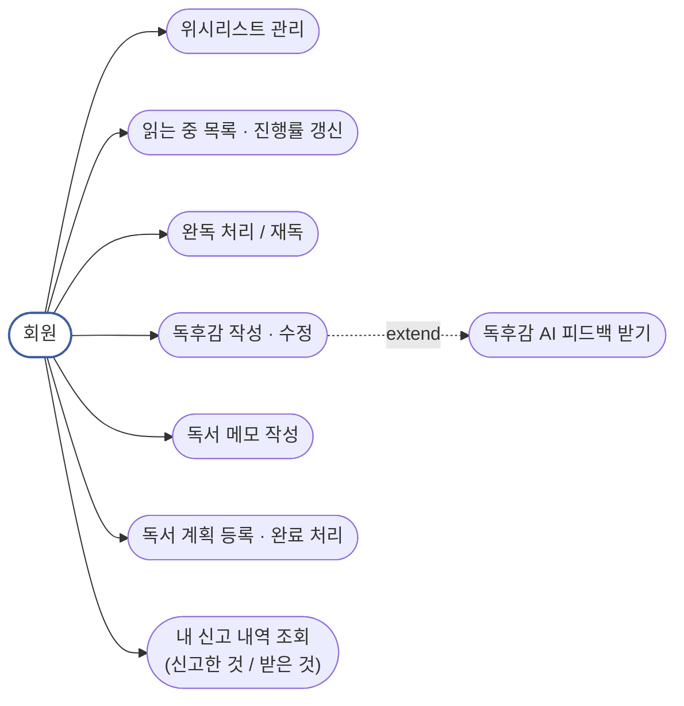
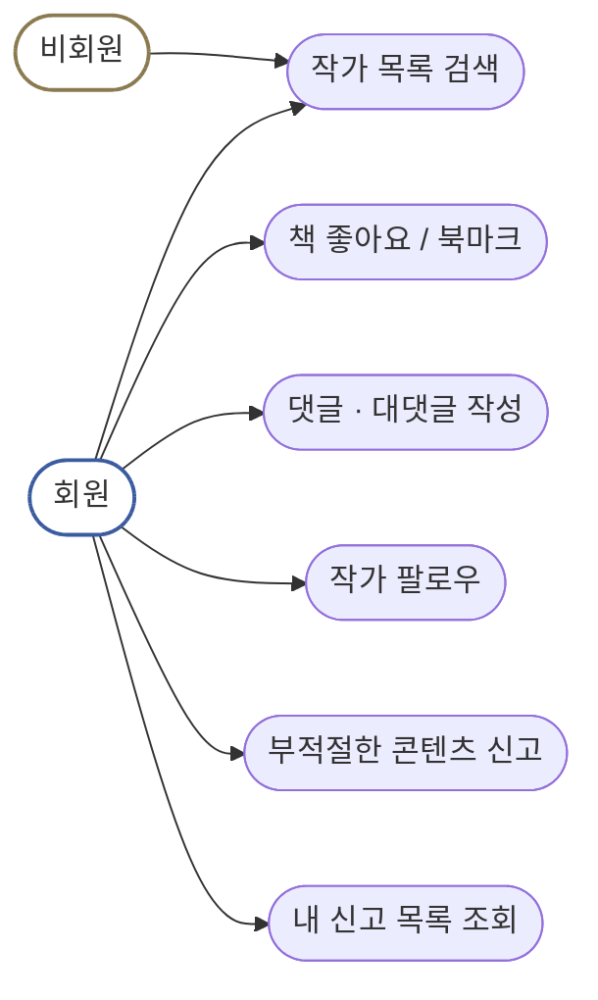
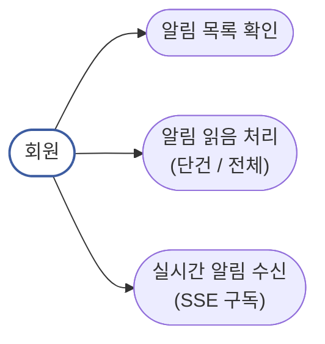
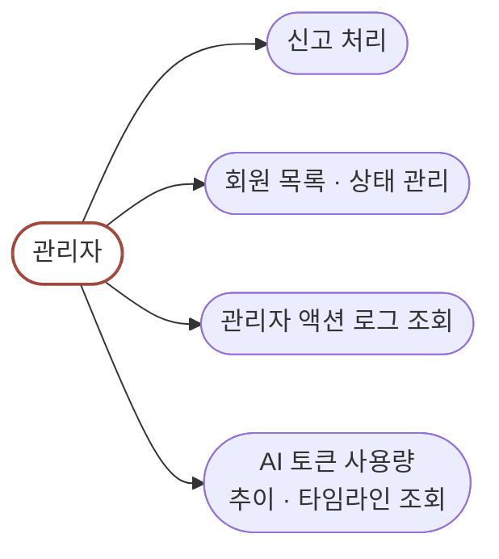

# 전체 시스템 유스케이스 다이어그램

실제 컨트롤러 엔드포인트(auth / member / subscription / ai / book / myLibrary / friendLibrary / notification / admin)를 기준으로 정리했다. "설계 문서"가 아니라 "지금 코드가 실제로 제공하는 기능" 기준이라, `EditorController`/`ReadingController`처럼 클래스만 있고 메서드가 없는 빈 스텁은 유스케이스에 넣지 않았다.

## 액터

| 액터 | 설명 |
| --- | --- |
| 비회원 | 로그인하지 않은 사용자. 책 열람, 랭킹, 작가 검색 등 공개 API만 접근 가능 |
| 회원 (FREE / PREMIUM) | 로그인한 사용자. 플랜에 따라 AI 생성 사용량 한도가 다름([04-subscription.md](./04-subscription.md) 참고) |
| 관리자 | `/api/admin/**` 전용, `SecurityConfig`에서 `hasRole("ADMIN")`으로 제한 |
| (외부) AI 서버 | Python FastAPI + Gemini. 백엔드가 텍스트/이미지 생성을 위임 호출하는 대상 |
| (외부) OAuth 제공자 | 카카오 · 네이버. 소셜 로그인/가입에 연동 |

## 개요 — 액터와 도메인

## 01. 인증 · 계정

`AuthController` · `OAuthController` · `MemberController`

## 02. 구독 · 결제

`SubscriptionController` · `PaymentController` · `UsageController`

## 03. AI 생성

`AiController` → `UsageService` · Python LLM 서버

## 04. 책 만들기 · 감상

`BookListController` · `WeeklyBookRankingController`

책 편집 자체는 프론트엔드에서 이루어지고, 백엔드는 `POST /api/books`(주석상 "책 생성(최종 저장)")로 발행 시점만 받는다. `EditorController`는 클래스만 있고 엔드포인트가 없는 빈 스텁이라 유스케이스에서 제외했다.

## 05. 내 서재

`MyLibraryController` · `BookReviewController` · `ReadingMemoController` · `ReadingPlanController`

## 06. 커뮤니티 (친구서재)

`BookLikeController` · `BookmarkController` · `CommentController` · `AuthorController` · `AuthorFollowController` · `ReportController`

## 07. 알림

`NotificationController` (Redis Streams + SSE, [06-notification-realtime.md](./06-notification-realtime.md) 참고)

## 08. 운영 · 관리

`AdminApi` / `AdminController` — 신고 처리 · 회원 관리 · AI 사용량 대시보드

