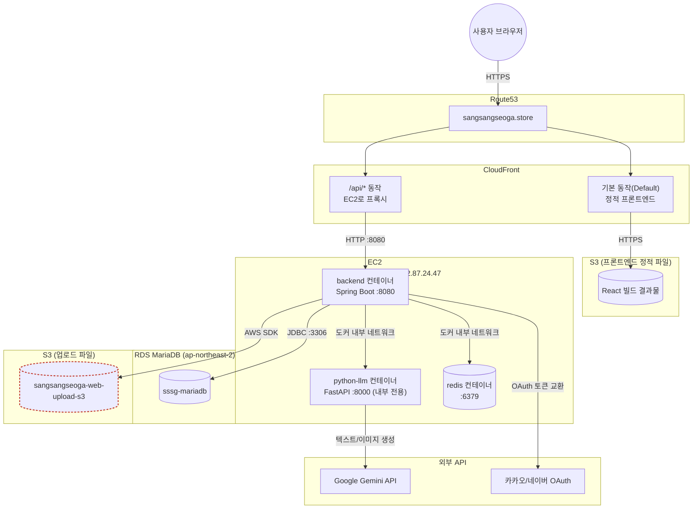
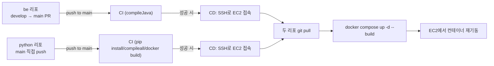

# 인프라 구성도 (실제 배포 기준)

`07-cloud-deployment.md`는 배포 **전** 설계(ALB+ACM 전제)였고, 이 문서는 **실제로 구축하면서 확정된 최종 구성**을 정리한다. 설계와 달라진 점은 각주로 남긴다.

## 전체 구성도

## 컴포넌트별 상태

| 구성 요소 | 값 | 비고 |
| --- | --- | --- |
| 도메인 | `sangsangseoga.store` (Route53 호스팅 영역 `Z04612421PQ79WO7FIMDF`) | |
| CloudFront | `d1et13yak1di6.cloudfront.net` | 기본 동작은 프론트엔드(S3), **`/api/*`는 EC2로 프록시** — 원래 설계였던 ALB+ACM 대신 이 구조로 대체됨 |
| CloudFront → EC2 origin | `ec2-52-87-24-47.compute-1.amazonaws.com:8080`, 프로토콜 **HTTP Only** | HTTPS Only/뷰어 일치로 두면 TLS 핸드셰이크가 안 되는 8080(평문)에 연결 시도하다 504 남 — 실제로 겪은 장애 원인 |
| EC2 인스턴스 | `i-0ac6810eb941eab5f`, `t3.micro`, **us-east-1**, 프라이빗 IP `172.31.29.120` | 메모리 1GB라 빌드 시 스왑(2GB) 추가해서 대응 |
| Elastic IP | `52.87.24.47` (`sssg-ec2`) | 재부팅해도 IP 고정 — 초기엔 자동할당 IP로 운영하다 CloudFront origin 어긋나는 문제를 겪고 나서 전환 |
| EC2 보안그룹 | `launch-wizard-1` (`sg-066b97495e0eb1c09`) | 인바운드 22/80/443/8080/8000 전부 `0.0.0.0/0` — 8000(python-llm)은 docker-compose가 호스트에 포트를 안 열어서 실질적으로 외부 접근 불가 |
| RDS | `sssg-mariadb.c3ecoskkcdmv.ap-northeast-2.rds.amazonaws.com` | **ap-northeast-2** — EC2(us-east-1)와 리전이 다름(아래 "확인 필요" 참고) |
| RDS 보안그룹 | `sssg-mariadb-security-group` | 3306을 EC2 프라이빗 IP + 개발자 PC IP로 허용 |
| 업로드 S3 | `sangsangseoga-web-upload-s3` | `STORAGE_TYPE=s3`, `S3_PUBLIC_BASE_URL`이 현재 CloudFront가 아니라 S3 버킷 URL 그대로임 |
| 컨테이너 구성 | `docker-compose.prod.yml` (backend/python-llm/redis) | [07-cloud-deployment.md](./07-cloud-deployment.md), [09-deployment-config.md](./09-deployment-config.md) 참고 |

## CI/CD 파이프라인

자세한 내용은 [09-deployment-config.md](./09-deployment-config.md) 4번 항목 참고.

## 알려진 갭 / 확인 필요 (빨간 테두리로 표시된 부분)

- **EC2에 IAM Role이 안 붙어있음** (인스턴스 세부정보의 "IAM 역할"이 `–`). `S3FileStorageService`는 `DefaultCredentialsProvider`로 자격증명을 찾는데, Role이 없으면 업로드 API가 실제로는 실패할 가능성이 높다. IAM Role 생성 후 이 인스턴스에 연결 필요.
- **EC2(us-east-1)와 RDS(ap-northeast-2) 리전이 다름.** 지금은 RDS가 퍼블릭 액세스 가능 상태라 인터넷 경유로 연결되는 것으로 보이는데, 이러면 지연시간이 늘고 트래픽 비용도 더 나온다. 같은 리전으로 재구성하는 걸 검토할 필요가 있다.
- **`S3_PUBLIC_BASE_URL`이 CloudFront가 아니라 S3 버킷 URL 그대로.** 업로드 버킷도 CloudFront를 앞에 두면 HTTPS로 안전하게 서빙되고 캐싱도 된다 — 지금은 버킷 자체가 퍼블릭 읽기 허용돼 있어야 이미지가 보임.
