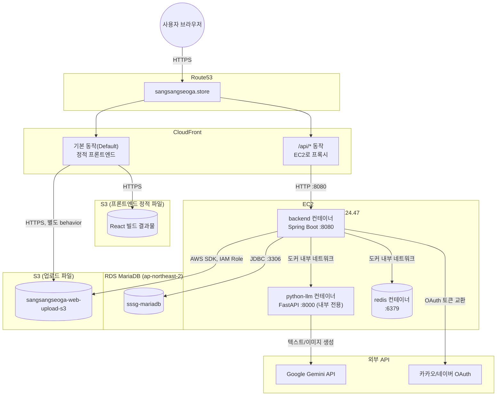
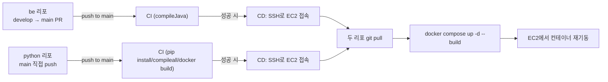

# 인프라 구성도 (실제 배포 기준)

`07-cloud-deployment.md`는 배포 **전** 설계(ALB+ACM 전제)였고, 이 문서는 **실제로 구축하면서 확정된 최종 구성**을 정리한다. 설계와 달라진 점은 각주로 남긴다.

## 전체 구성도

## 컴포넌트별 상태

| 구성 요소 | 값 | 비고 |
| --- | --- | --- |
| 도메인 | `sangsangseoga.store` (Route53 호스팅 영역 `Z04612421PQ79WO7FIMDF`) | |
| CloudFront | `d1et13yak1di6.cloudfront.net` | 기본 동작은 프론트엔드(S3), **`/api/*`는 EC2로 프록시** — 원래 설계였던 ALB+ACM 대신 이 구조로 대체됨 |
| CloudFront → EC2 origin | `ec2-52-87-24-47.compute-1.amazonaws.com:8080`, 프로토콜 **HTTP Only** | HTTPS Only/뷰어 일치로 두면 TLS 핸드셰이크가 안 되는 8080(평문)에 연결 시도하다 504 남 — 실제로 겪은 장애 원인 |
| EC2 인스턴스 | `i-0ac6810eb941eab5f`, `t3.micro`, **us-east-1**, 프라이빗 IP `172.31.29.120` | 메모리 1GB라 빌드 시 스왑(2GB) 추가해서 대응 |
| Elastic IP | `52.87.24.47` (`sssg-ec2`) | 재부팅해도 IP 고정 — 초기엔 자동할당 IP로 운영하다 CloudFront origin 어긋나는 문제를 겪고 나서 전환 |
| EC2 보안그룹 | `launch-wizard-1` (`sg-066b97495e0eb1c09`) | 인바운드 22/80/443/8080/8000 전부 `0.0.0.0/0` — 8000(python-llm)은 docker-compose가 호스트에 포트를 안 열어서 실질적으로 외부 접근 불가 |
| RDS | `sssg-mariadb.c3ecoskkcdmv.ap-northeast-2.rds.amazonaws.com` | ap-northeast-2. EC2(us-east-1)와 리전은 다르지만 확인 결과 운영상 문제로 취급하지 않기로 함 |
| RDS 보안그룹 | `sssg-mariadb-security-group` | 3306을 EC2 프라이빗 IP + 개발자 PC IP로 허용 |
| EC2 IAM Role | 연결됨 | `S3FileStorageService`가 `DefaultCredentialsProvider`로 이 Role의 임시 자격증명을 사용해 업로드 S3에 접근 |
| 업로드 S3 | `sangsangseoga-web-upload-s3` | `STORAGE_TYPE=s3`. 기존 프론트엔드 CloudFront 배포에 오리진/behavior를 추가해 CloudFront 경유로 서빙 |
| 컨테이너 구성 | `docker-compose.prod.yml` (backend/python-llm/redis) | [07-cloud-deployment.md](./07-cloud-deployment.md), [09-deployment-config.md](./09-deployment-config.md) 참고 |

## CI/CD 파이프라인

자세한 내용은 [09-deployment-config.md](./09-deployment-config.md) 4번 항목 참고.

## CloudFront — API 에러 응답과 SPA 라우팅 분리

원래는 "403/404 → `/index.html` 200 응답"이라는 Custom Error Response로 새로고침 시 React Router 딥링크가 깨지는 걸 막았는데, 이 규칙이 배포 전체에 걸려서 `/api/*`가 내려주는 401/403/404까지 전부 `index.html`로 가로채는 부작용이 있었다(예: 정지 계정 로그인 시 백엔드가 보낸 403 JSON 대신 프론트 index.html이 200으로 내려가 에러 메시지가 안 보임).

- Error pages 탭의 403/404 → index.html 커스텀 에러 응답 삭제
- 대신 정적 프론트엔드 behavior(Default `*`)의 **Viewer request**에 CloudFront Function을 연결: `/api/`로 시작하지 않고 확장자가 없는 경로만 `/index.html`로 리라이트
- `/api/*` behavior는 원본(EC2) 응답을 그대로 통과시키므로 API 에러 바디가 더 이상 가려지지 않는다
