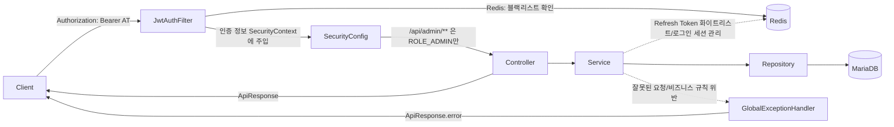

# 상상서가 백엔드 - 담당 영역 레퍼런스

제가(ChoiSW) 담당한 영역인 **공통 구조(global) / 인증(auth) / 회원(member) / 구독·결제(subscription) / 관리자(admin)** 가 실제로 어떻게 구현되어 있고 어떻게 쓰이는지 정리한 문서입니다. "무엇을 했는지"가 아니라 "지금 코드가 어떻게 동작하는지" 기준으로 씁니다.

| 문서 | 내용 |
| --- | --- |
| [01-common-structure.md](./01-common-structure.md) | 레이어드 구조, 공통 응답(`ApiResponse`), 에러 처리 체계, 인가 방식, Swagger 에러코드 자동화 |
| [02-auth-jwt.md](./02-auth-jwt.md) | 회원가입/로그인/토큰 재발급/로그아웃, JWT 구조, Redis 기반 토큰 관리(화이트리스트 + 블랙리스트) |
| [03-member.md](./03-member.md) | `Member` 엔티티, 상태 전이, 낙관적 락, 보호자 동의(만 14세 미만) 흐름 |
| [04-subscription.md](./04-subscription.md) | 구독 플랜/결제(Mock), 만료 정리(reconcile) 패턴, 배치 스케줄러 |
| [05-admin.md](./05-admin.md) | 신고 처리, 회원 관리(목록/상태 변경) |

## 요청 처리 흐름 (공통)

세부 동작은 각 문서를 참고하세요.
